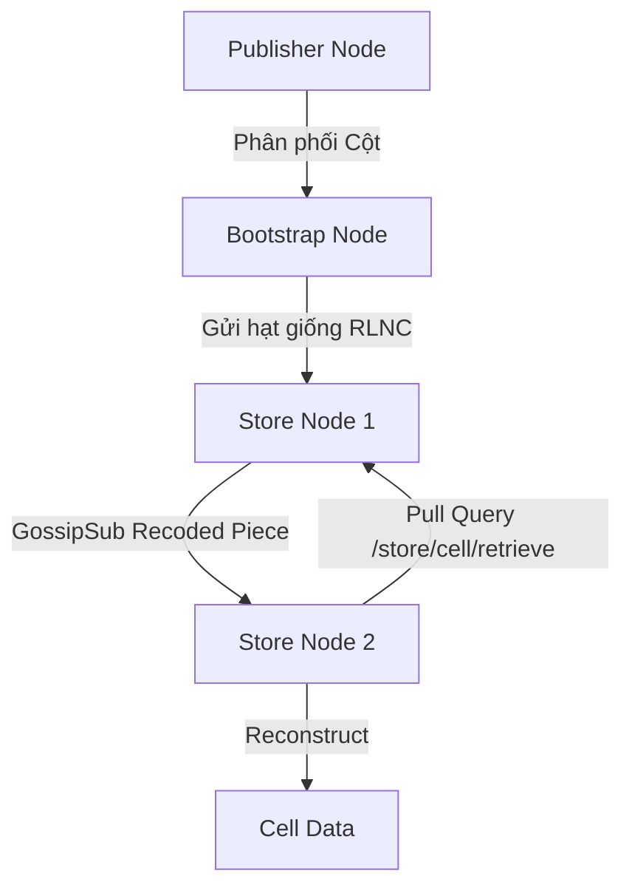

# Tài Liệu Kiến Trúc & Kiểm Thử Hệ Thống CDA (Coded Data Availability) Network

Tài liệu này mô tả chi tiết về hành vi của các node, các luồng kiểm thử đã thực hiện và định hướng thiết kế hệ thống mạng phân tán CDA khi triển khai thực tế.

---

## 1. Tổng Quan Hệ Thống CDA

Mạng CDA (Coded Data Availability) được thiết kế nhằm đảm bảo tính khả dụng của dữ liệu (Data Availability) cho các Layer 2 Rollups và blockchain thông qua việc kết hợp các kỹ thuật mã hóa sửa lỗi tiên tiến:
*   **Mã hóa Reed-Solomon (2D Erasure Coding):** Mở rộng Ma trận dữ liệu gốc (ODS - Original Data Square) kích thước $K \times K$ thành Ma trận dữ liệu mở rộng (EDS - Extended Data Square) kích thước $2K \times 2K$.
*   **Mã hóa tuyến tính ngẫu nhiên (RLNC - Random Linear Network Coding):** Chia nhỏ từng ô (cell) trong EDS thành $K$ mảnh (fragments) và tạo ra các tổ hợp tuyến tính ngẫu nhiên (coded pieces) nhằm tăng hiệu quả truyền tải và giảm thiểu sự trùng lặp.
*   **Cam kết KZG (KZG Commitments & Proofs):** Cung cấp bằng chứng mật mã học giúp kiểm tra tính đúng đắn của mảnh dữ liệu mà không cần giải mã toàn bộ ô.

---

## 2. Chi Tiết Hành Vi Của Các Node

Hệ thống bao gồm ba loại node chính với các trách nhiệm riêng biệt:



### A. Publisher Node (Node Phát Hành)
*   **Tiếp nhận dữ liệu ODS:** Nhận khối dữ liệu thô từ Layer 2 Rollup hoặc Sequencer.
*   **Mã hóa 2D Erasure Coding:** Sử dụng thư viện Leopard (hoặc thuật toán tương đương) để mã hóa mở rộng ODS thành EDS kích thước $2K \times 2K$.
*   **Tạo cam kết (Commitments):** 
    *   Tạo các cam kết KZG cho từng cột dữ liệu.
    *   Tính toán mã băm Merkle Tree trên các cam kết cột để lấy `commits_root` đại diện cho Block Header.
*   **Phân phối dữ liệu:** Gửi các cột dữ liệu EDS tương ứng kèm theo Merkle proof đến các Bootstrap Node chịu trách nhiệm cho cột đó.

### B. Bootstrap Node (Node Khởi Tạo Cột)
*   **Neo cam kết:** Tiếp nhận dữ liệu cột và xác thực Merkle proof của cột với `commits_root` từ Publisher.
*   **Tạo KZG Opening Proofs (Phase 2 Async):** 
    *   Thực hiện tính toán song song, không đồng bộ các bằng chứng mở (opening proofs) tại tọa độ $z = row$ cho tất cả các hàng trong cột.
*   **Mã hóa RLNC & Phân phối:**
    *   Đánh giá đa thức biểu diễn cột tại từng hàng để thu được các mảnh dữ liệu gốc (evaluation form).
    *   Tạo $K$ mảnh hạt giống (seed pieces) bằng RLNC với vector hệ số ngẫu nhiên trong miền $[1, 10]$ để tránh trùng lặp tuyến tính và lỗi tràn byte (limit 255).
    *   Gửi trực tiếp các mảnh hạt giống này đến custody Store Node tương ứng trong cột.

### C. Store Node (Node Lưu Trữ Custody)
*   **Neo cam kết neo giữ (Commitment Anchoring):**
    *   **Layer 1 Verification:** Kiểm tra Merkle proof của cam kết cột.
    *   **Layer 2 Verification:** Thực hiện phép kết hợp homomorphic $\sum x_j \cdot C_j == C^{\text{col}}_c$ sử dụng vector thử thách phi tập trung $x$.
*   **Lưu trữ custody và Xác thực mảnh:**
    *   **Layer 3 Verification (KZG Pairing):** Xác thực từng mảnh RLNC nhận được (hoặc lan truyền qua Gossip) bằng cách kiểm tra cặp song tuyến tính (pairing check) giữa dữ liệu mảnh, hệ số mã hóa và bằng chứng mở KZG.
*   **Bộ lọc độc lập tuyến tính (Gaussian Rank Filter):**
    *   Trước khi lưu trữ, Store Node sử dụng phép khử Gauss (`rlnc.SolveGaussian`) để kiểm tra xem mảnh mới nhận được có độc lập tuyến tính với các mảnh hiện có hay không.
    *   Loại bỏ các mảnh phụ thuộc tuyến tính (trùng lặp hoặc dư thừa) để tối ưu hóa không gian lưu trữ và đảm bảo tính khả nghịch của ma trận hệ số.
*   **Tái mã hóa (Recoding) & GossipSub:**
    *   Khi tích lũy được $\ge 2$ mảnh độc lập tuyến tính, node tự động thực hiện tái mã hóa (Recode) bằng cách kết hợp tuyến tính ngẫu nhiên các mảnh hiện có nhằm tạo ra mảnh mới.
    *   Lan truyền các mảnh tái mã hóa này đến các Store Node lân cận thông qua cơ chế GossipSub (HTTP POST).
*   **Truy vấn kéo chủ động (Peer Pull Retrieval):**
    *   Khi nhận được yêu cầu phục hồi ô nhưng số lượng mảnh độc lập cục bộ $< K$, node sẽ gửi truy vấn HTTP đến các node lân cận được cấu hình qua tham số `-peers`.
    *   Sử dụng cờ truy vấn `?remote=true` để ngăn chặn vòng lặp truy vấn vô hạn (Query Loops) giữa các node trong mạng.
*   **Phục hồi ô dữ liệu (Cell Reconstruction & Unpadding):**
    *   Khi thu thập đủ $K$ mảnh độc lập tuyến tính từ lưu trữ cục bộ hoặc từ các node lân cận, node sử dụng phép khử Gauss để giải mã phục hồi ô dữ liệu gốc.
    *   Cắt bỏ phần zero-padding (vốn được thêm vào do biểu diễn phần tử trường 32-byte) để trả về đúng dữ liệu gốc (64-byte đối với ODS cell).

---

## 3. Luồng Kiểm Thử Đã Thực Hiện

Hai kịch bản kiểm thử tích hợp đầu-cuối (E2E) đã được triển khai và xác thực thành công:

### Kịch bản 1: Kiểm thử custody và xác thực cơ bản (`test_interaction.sh`)
*   **Mô tả:** Kiểm tra toàn bộ vòng đời dữ liệu từ lúc phát hành đến khi lưu trữ custody trên 1 Store Node đơn lẻ.
*   **Các bước:**
    1.  Khởi động Publisher, Bootstrap Node và 1 Store Node.
    2.  Publisher gửi khối dữ liệu ODS (gồm 16 ô 64-byte).
    3.  Bootstrap Node nhận cột, tạo KZG proofs không đồng bộ, mã hóa RLNC và gửi mảnh đến Store Node.
    4.  Store Node thực hiện neo giữ cam kết thành công (vượt qua Layer 1 & 2) và xác thực thành công các mảnh RLNC nhận được (vượt qua Layer 3).
*   **Kết quả:** Tất cả các kiểm tra mật mã học đều khớp, mảnh hợp lệ được lưu trữ và tái mã hóa thành công.

### Kịch bản 2: Kiểm thử mạng cột đa Store Node (`test_multi_store.sh`)
*   **Mô tả:** Mô phỏng mạng lưới 3 Store Node cùng nằm trên một cột mạng để kiểm tra khả năng tái mã hóa, lan truyền Gossip và chủ động kéo mảnh phục hồi ô dữ liệu.
*   **Sơ đồ luồng dữ liệu kiểm thử:**
    ```
    Bootstrap Node --> Store Node 1 (8082) [Nhận 4 seeds ban đầu]
                             |
                   (Tái mã hóa & GossipSub)
                             v
                       Store Node 2 (8083) [Tích lũy được < 4 mảnh]
                             |
                (Query /store/cell/retrieve)
                             v
                       Store Node 1 (8082) & Store Node 3 (8084)
                             |
             (Trả về mảnh độc lập tuyến tính)
                             v
                       Store Node 2 (8083) [Tích lũy đủ K=4 mảnh độc lập]
                             |
                       (Reconstruct & Unpad)
                             v
                       [Khớp ô dữ liệu gốc 64-byte]
    ```
*   **Kết quả chạy thử thực tế:**
    - Store Node 2 ban đầu chỉ giữ 0 mảnh hợp lệ.
    - Khi nhận yêu cầu phục hồi ô `[0, 0]`, Store Node 2 nhận diện thiếu mảnh ($0 < 4$), chuyển hướng yêu cầu kéo mảnh từ Store Node 1.
    - Store Node 1 trả về các mảnh của nó. Store Node 2 lọc và giữ lại 4 mảnh độc lập tuyến tính.
    - Node giải mã thành công ô dữ liệu gốc, loại bỏ padding và trả về kết quả khớp chính xác với ô dữ liệu gốc đã phát hành (`...00000001`).

---

## 4. Định Hướng Hệ Thống Triển Khai Thực Tế

Khi chuyển dịch hệ thống từ môi trường giả lập (simulation) sang mạng lưới sản xuất (production), các thành phần sau sẽ được tối ưu hóa và mở rộng:

### A. Cấu Trúc Subnet Theo Cột (Column-based Subnets)
*   **Libp2p Gossipsub:** Thay thế giao thức HTTP Gossip mô phỏng bằng các kênh GossipSub thực tế của `libp2p`. Mạng lưới sẽ được chia nhỏ thành các Subnet tương ứng với từng ID cột ($0 \le colIdx < 2K$).
*   **Lợi ích:** Các node chỉ cần tham gia vào Subnet của cột dữ liệu mà họ có nghĩa vụ custody, giúp giảm tải băng thông mạng tối đa và tăng khả năng mở rộng ngang (horizontal scaling).

### B. Cơ Chế Proof of Custody (Bằng Chứng Lưu Trữ Custody)
*   **Tương tác Smart Contract (L1):** Store Node định kỳ gửi bằng chứng custody lên Smart Contract trên Layer 1 để nhận phần thưởng (staking rewards).
*   **Nội dung Proof:** Bao gồm chữ ký mật mã học trên các mảnh RLNC được kết hợp với một giá trị ngẫu nhiên (ephemeral challenge) được sinh ra từ block header của Layer 1.

### C. Cơ Chế Khôi Phục Khối Dữ Liệu Lỗi (Distributed Block Reconstruction)
*   **DAS (Data Availability Sampling):** Các Light Node trong mạng sẽ thực hiện chọn ngẫu nhiên các ô (cells) trong EDS để kiểm tra tính khả dụng.
*   **Distributed Recovery:** Nếu một Bootstrap Node hoặc Publisher bị lỗi, các Store Node trong cột sẽ cộng tác với nhau (qua cơ chế kéo mảnh và tái mã hóa) để khôi phục toàn bộ các ô của cột đó. Sau đó, thông qua Reed-Solomon decoding xuyên suốt các cột, toàn bộ khối dữ liệu ODS gốc sẽ được phục hồi một cách an toàn.

### D. Tối Ưu Hóa Hiệu Năng Tính Toán
*   **GPU-accelerated KZG Proofs:** Chuyển đổi việc tính toán KZG commitments và KZG opening proofs của Bootstrap Node sang chạy trên GPU sử dụng các thư viện mật mã tối ưu hóa (như CUDA/C++ wrappers cho bls12-381).
*   **Pipeline Execution:** Thiết lập luồng xử lý dạng đường ống (pipeline) cho phép Publisher mã hóa ODS, Bootstrap Node tính proofs, và Store Node xác thực mảnh được thực hiện đồng thời gối đầu nhau theo từng block.
