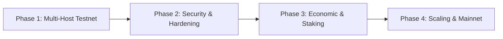

# Đánh Giá Hệ Thống & Lộ Trình Triển Khai Thực Tế (CDA Network)

Tài liệu này tổng hợp phân tích chuyên sâu về **hiện trạng hệ thống CDA Network**, đánh giá các ưu điểm kỹ thuật vượt trội, chỉ ra các điểm nghẽn cần hoàn thiện và vạch ra **lộ trình từng bước (Phase 1 → Phase 4)** để đưa hệ thống từ môi trường Prototype lên mạng lưới Production phi tập trung quy mô lớn.

---

## 1. Đánh Giá Hệ Thống Hiện Tại (Current System Evaluation)

### A. Các Điểm Mạnh Vượt Trội (Key Technical Strengths)

1. **Mã Hóa 2D Reed-Solomon Siêu Tốc (SIMD Leopard Codec):**
   - Tốc độ mở rộng ma trận ODS $\to$ EDS $32 \times 32$ chỉ mất **$\sim 3\text{ ms}$**.
   - Tốc độ giải mã phục hồi ngang (Horizontal RS Row Reconstruction) cho toàn bộ 32 hàng chỉ mất **$\sim 0.3 - 0.7\text{ ms}$** (dưới 1 mili-giây), cho phép tái tạo $100\%$ dữ liệu gốc ngay cả khi mất tới **$50\%$ số cột**.

2. **Cơ Chế Bảo Mật & Xác Thực 3 Lớp (3-Layer Verification):**
   - **Layer 1:** Merkle Proof xác thực từng piece commitment so với `commits_root`.
   - **Layer 2:** KZG inner-product commitment kiểm chứng tính toàn vẹn của cả cột dữ liệu so với `column_comm`.
   - **Layer 3:** Pairing check đại số trực tiếp ngăn chặn $100\%$ các mảnh Byzantine bị Store Node cố tình làm sai lệch nội dung.

3. **Thiết Kế Tách Biệt Kích Thước Khối $K$ và Phân Mảnh $K_{piece}$:**
   - Cho phép mở rộng dung lượng khối lên ma trận lớn ($K=16, 32, 64$) mà vẫn duy trì $K_{piece}=4$ hoặc $8$.
   - Giảm thiểu tối đa overhead bùng nổ lưu lượng truyền tin P2P (bandwidth amplification) so với các giải pháp DAS truyền thống.

4. **Tối Ưu Hóa Lưu Trữ Đối Xứng & Dọn Dẹp Đĩa (Symmetric Custody & Pruning):**
   - Store Node chỉ lưu trữ $K_{piece}$ mảnh cho các ô thuộc quyền custody và $1$ mảnh recoded duy nhất cho các ô non-custody.
   - Cơ chế tự động prune mảnh thô thừa sau TTL 15s và Garbage Collection BadgerDB giúp tiết kiệm **$98\%$ dung lượng đĩa** ($\sim 43\text{ MB}$ thực tế thay vì 2.28 GB ảo).

5. **Giám Sát Thời Gian Thực (Full-Stack Observability):**
   - Tích hợp sẵn bộ chỉ số Prometheus đo lường chi tiết: Throughput, RS/KZG Latency, Byzantine Detections, Piece Distribution và DAS Success Rate.
   - Dashboard Grafana tự động cập nhật số liệu theo thời gian thực (chu kỳ 5s).

---

### B. Các Điểm Nghẽn Kỹ Thuật Cần Hoàn Thiện (Technical Limitations to Address)

| Thành Phần | Hiện Trạng Trong Prototype | Yêu Cầu Cho Môi Trường Production |
|---|---|---|
| **P2P Discovery & Matrix Routing** | Dùng cấu hình tĩnh Multiaddr hoặc danh sách cổng Bootstrap cố định. | Triển khai **DNS Seed (`seed.cda-network.org`)** hoặc **Genesis Seed List** kết hợp với **2D Matrix Peer Exchange (Horizontal Row Discovery)** để tự động hòa mạng mà không cần Kademlia DHT. |
| **Lưu Trữ Bền Vững Publisher** | Chỉ lưu tạm trong bộ nhớ RAM, mất block header nếu restart. | Bổ sung database bền vững (BadgerDB/PostgreSQL) cho Publisher để lưu trữ lịch sử header phục vụ query lâu dài. |
| **Incentive & Slashing** | Chưa có cơ chế khen thưởng và phạt Store Node. | Cần Smart Contract trên Layer 1/2 để quản lý Staking, Proof of Custody và Slashing khi phát hiện gian lận. |

---

## 2. Hướng Triển Khai Thực Tế (Production Deployment Roadmap)

Lộ trình triển khai được chia làm 4 giai đoạn chiến lược:

---

### 🌐 Phase 1: Môi Trường Testnet Đa Máy Chủ (Multi-Host Geo-Distributed Testnet)

*Mục tiêu: Đưa hệ thống từ môi trường 1 máy chủ lên cụm máy chủ phân tán trên Cloud toàn cầu để kiểm thử độ trễ mạng thực tế.*

1. **Phân Bổ Hạ Tầng Địa Lý (Multi-Region Cloud Topology):**
   - **Publisher & Bootstraps:** Triển khai trên cụm máy chủ băng thông cao (1 Gbps+) tại các trung tâm dữ liệu chính (US East, EU Central, AP Southeast).
   - **Store Nodes:** Phân bổ rải rác trên các nhà cung cấp cloud độc lập (AWS, Hetzner, OVH, DigitalOcean) để giả lập mạng lưới phi tập trung thực sự.
   - **Light Nodes:** Chạy trên các máy client biên hoặc thiết bị người dùng.
2. **Triển Khai DNS Seed & 2D Matrix Peer Exchange:**
   - Cấu hình domain `seed.cda-network.org` trỏ về danh sách IP Bootstrap Nodes đang active (Seed Nodes).
   - Node mới / Light Node chỉ cần kết nối tới **1 Seed Bootstrap Node duy nhất** để tự động khám phá toàn bộ các Subnet Hàng và Subnet Cột thông qua cơ chế định tuyến ma trận 2D mà không cần Kademlia DHT.
3. **Đóng Gói & Điều Phối Tự Động:**
   - Xây dựng **Helm Charts / Kubernetes Operator** cho các nhà vận hành node chuyên nghiệp.
   - Cung cấp file cấu hình `systemd` service và Docker standalone image gọn nhẹ cho người dùng cá nhân.

---

### 🛡️ Phase 2: Nâng Cấp Mật Mã Học & Bảo Mật (Cryptographic Hardening)

*Mục tiêu: Đảm bảo tính toàn vẹn tuyệt đối của dữ liệu và ngăn chặn mọi hình thức tấn công giả mạo.*

1. **Tích Hợp Trusted Setup SRS Chuẩn Hóa:**
   - Sử dụng file SRS $G_1, G_2$ chuẩn từ Ethereum KZG Ceremony.
   - Tối ưu hóa việc nạp SRS vào bộ nhớ thông qua `mmap` để khởi động node tức thì trong $< 100\text{ ms}$.
2. **Xác Thực Sequencer & Chống Spam:**
   - Publisher chỉ chấp nhận khối có chữ ký hợp lệ từ Sequencer được ủy quyền.
   - Tích hợp Rate Limiting và Proof-of-Work / Gas Fee để chống DoS endpoint `/publish`.
3. **Xây Dựng Bộ SDK Client Đa Ngôn Ngữ:**
   - Phát triển thư viện SDK gọn nhẹ bằng **Go, Rust, TypeScript** để các Rollup Client (Arbitrum Nitro, Optimism Bedrock, Polygon CDK) có thể tích hợp trực tiếp để xác thực DAS.

---

### 💰 Phase 3: Cơ Chế Kinh Tế & Proof of Custody (Incentive & Slashing Layer)

*Mục tiêu: Tạo động lực kinh tế cho Store Node lưu trữ dữ liệu trung thực và xử phạt nghiêm khắc các node gian lận.*

1. **Staking & Đăng Ký Verifiable Custody:**
   - Store Node phải khóa (stake) một lượng token nhất định trên Smart Contract L1/L2.
   - Khóa công khai của Store Node được gắn chặt với tọa độ hàng/cột được chỉ định (`Verifiable Address Mapping`).
2. **Xác Minh Bằng Chứng Lưu Trữ Định Kỳ (Periodic Custody Challenges):**
   - Smart Contract định kỳ sinh ra số ngẫu nhiên (VRF) yêu cầu Store Node nộp bằng chứng đại số cho ô dữ liệu thuộc quyền custody của mình.
   - Store Node nộp đúng bằng chứng sẽ nhận phần thưởng phí lưu trữ (DA Fee Rewards).
3. **On-chain Fraud Proof (Slashing Byzantine Nodes):**
   - Khi Light Node phát hiện mảnh dữ liệu giả mạo (Layer 3 verification thất bại), Light Node có thể gửi trực tiếp bằng chứng gian lận (Fraud Proof) lên Smart Contract.
   - Smart Contract tự động tịch thu (slash) toàn bộ tiền cược của Store Node vi phạm và trả thưởng cho Light Node đã phát hiện.

---

### ⚡ Phase 4: Tối Ưu Hóa Quy Mô & Mainnet Launch (High-Throughput Scaling)

*Mục tiêu: Tối đa hóa thông lượng dữ liệu (100 MB/s+) và sẵn sàng cho việc ra mắt mạng chính thức.*

1. **Tăng Tốc Sinh KZG Proofs Bằng Phần Cứng (Hardware Acceleration):**
   - Sử dụng tập lệnh **AVX-512** (CPU) hoặc **NVIDIA CUDA** (GPU) để song song hóa quá trình sinh KZG Opening Proofs tại Bootstrap Nodes.
   - Cho phép xử lý kích thước khối cực lớn ($K = 64 \to 128$) với thời gian sinh proof $< 1\text{ giây}$.
2. **P2P Peer Scoring & Topic Isolation:**
   - Kích hoạt cơ chế tính điểm uy tín (Peer Scoring) trong `libp2p-pubsub`.
   - Tự động ngắt kết nối và blacklist vĩnh viễn các peer gửi tin nhắn rác hoặc chậm trễ.
3. **Mainnet Genesis & Decoupled Storage Pools:**
   - Thiết lập Genesis State cho mạng lưới, mở rộng số lượng cột mạng lên 32 hoặc 64 cột để hỗ trợ hàng nghìn Store Node tham gia lưu trữ phi tập trung.

---

## 3. Bảng Tổng Hợp So Sánh: Prototype vs Production

| Tiêu Chí | CDA Prototype Hiện Tại | CDA Production Hoàn Chỉnh |
|---|---|---|
| **Môi trường chạy** | Docker Compose đơn máy chủ | Cụm máy chủ phân tán Geo-Distributed (Multi-Cloud / Bare-metal) |
| **Quy mô ma trận** | $K=16$ ($32 \times 32$ EDS, 1 MB/block) | $K=64 - 128$ ($256 \times 256$ EDS, 16 - 64 MB/block) |
| **Khám phá mạng** | 2D Matrix Peer Exchange (1 Seed Node) | DNS Seed `seed.cda-network.org` + 2D Matrix Discovery |
| **KZG Parameter** | SRS sinh ngẫu nhiên trong RAM | Trusted Setup Ceremony File (Ethereum Standard) |
| **Xác thực dữ liệu** | Merkle + KZG + Pairing (100% Passed) | Merkle + KZG + Pairing + On-chain Verification |
| **Kinh tế & Phạt** | Giả lập | Staking Token + Proof of Custody + Automated Slashing |
| **Khả năng phục hồi** | Khôi phục 100% khi mất 50% cột | Khôi phục phân tán tự động qua mạng P2P với tốc độ Sub-second |
