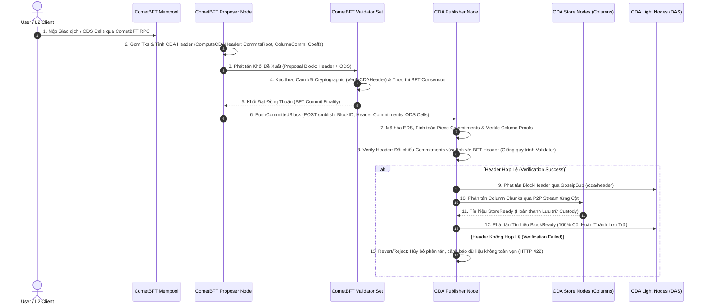

# Tài Liệu Hiện Trạng & Kế Hoạch Tích Hợp Đồng Thuận CometBFT Vào CDA Network

Tài liệu này trình bày chi tiết hiện trạng hiện thực, kiến trúc tùy biến khối dữ liệu BFT và kế hoạch tích hợp chuyển đổi từ cơ chế tạo khối giả lập (Simulated Publishing) sang **Lớp Đồng Thuận CometBFT Thực Tế (Real BFT Block Production)** cho hệ thống **CDA Network (Data Availability Layer)**.

---

## 1. Tổng Quan & Mục Tiêu Architecture Integration

### 1.1. Hiện Trạng Trước Khi Tích Hợp
Trước đây, hệ thống CDA Network sử dụng service **Publisher Node** kết hợp cùng các công cụ giả lập (`publish.sh`, `block_publisher_bot.py`) để tạo khối:
- Client bên ngoài gửi dữ liệu trực tiếp tới REST API `POST /publish` của Publisher Node.
- Publisher Node tự sinh mã khối `BlockID` (dạng `manual-block-1`, `block-X`) không qua đồng thuận BFT.
- Chưa có cơ chế đồng thuận phân tán giữa các validator để chốt thứ tự khối và xác thực cryptographic gốc (Root of Trust) trước khi lưu trữ.

### 1.2. Mục Tiêu Tích Hợp Mới
Thay thế toàn bộ quy trình giả lập bằng **CometBFT Consensus Engine**:
- **CometBFT (Layer BFT Consensus)**: Đóng vai trò là mạng lưới các Node Validator chạy thuật toán đồng thuận Tendermint/CometBFT BFT. Tiếp nhận giao dịch/ODS cells, đóng gói vào Block BFT, tính toán và xác thực các cam kết mã hóa CDA (CommitsRoot, ColumnComm, Coeffs), sau đó chốt khối (BFT Finality).
- **PublisherPusher Bridge**: Ngay khi block được chốt đồng thuận BFT, CometBFT tự động chuyển giao (push) khối dữ liệu finalized kèm toàn bộ cam kết BFT Header sang Publisher Node.
- **Publisher Node (Layer DA Distribution & Active Verification)**: Tiếp nhận khối dữ liệu và cam kết Root of Trust từ CometBFT. Trước khi phân tán, Publisher **thực hiện bước kiểm tra xác thực Header (Verify Header)** đối chiếu với các cam kết mật mã (`CommitsRoot`, `ColumnComm`, `Coeffs`) tương tự như quy trình xác thực đồng thuận của các Validator Node. Khi và chỉ khi xác thực thành công, Publisher mới tiến hành phát tán Block Header tới Light Nodes qua GossipSub và phân tán các cột dữ liệu tới Store Nodes qua P2P stream.

---

## 2. Phân Tích Hiện Trạng Tùy Biến Cấu Trúc Khối Trong CometBFT (`cometbft/`)

Mã nguồn CometBFT nằm tại thư mục `cometbft/` đã được tùy biến chuyên sâu để hỗ trợ giao thức CDA Network:

### 2.1. Mở Rộng Block Header (`cometbft/types/block.go`, `cometbft/proto/tendermint/types/types.proto`)
Cấu trúc `Header` của CometBFT đã được bổ sung 3 trường cam kết Root of Trust của CDA:
- `CommitsRoot` (`cmtbytes.HexBytes`): Gốc cây Merkle (Merkle Root) của mảng các KZG piece commitments.
- `ColumnComm` (`[][]byte`): Mảng các cam kết KZG Kate theo từng cột của ma trận EDS.
- `Coeffs` (`[]byte`): Vector chứa các hệ số mã hóa mạng tuyến tính RLNC (Random Linear Network Coding).

```go
type Header struct {
    // ... Các trường tiêu chuẩn của CometBFT (Version, ChainID, Height, Time, LastBlockID, DataHash, ...)
    
    // CDA Root of Trust fields
    CommitsRoot cmtbytes.HexBytes `json:"commits_root"`
    ColumnComm  [][]byte          `json:"column_comm"`
    Coeffs      []byte            `json:"coeffs"`
}
```

### 2.2. Mở Rộng Block Data (`cometbft/types/block.go`)
Cấu trúc `Data` chứa thông tin ODS matrix của khối:
- `Data.ODS` (`ODSData`): Lưu trữ mảng các tế bào $K \times K$ (Original Data Square cells) trực tiếp bên trong block BFT.

```go
type ODSData struct {
    K     int      `json:"k"`
    Cells [][]byte `json:"cells"`
}
```

### 2.3. Đối Chiếu Thực Tế Các Hàm Từ Thư Viện Core `rlnc-rsmt2d` Trong Toàn Bộ Hệ Thống CDA

Kết quả rà soát mã nguồn thực tế ghi nhận các hàm thuộc repository core `rlnc-rsmt2d` (`github.com/DataAvailabilityLayerNovel/rlnc-rsmt2d`) đang được gọi trực tiếp tại các module trong hệ thống CDA như sau:

| Gói Core `rlnc-rsmt2d` | Hàm / Cấu trúc | Vị trí gọi trong hệ thống CDA | Mục đích trong luồng thực tế |
| :--- | :--- | :--- | :--- |
| **`cda`** | `cda.ComputeExtendedDataSquareWithLeopard(odsData)` | • `cda-publisher-node/internal/engine/pipeline.go` (Line 38)<br>• `cometbft/state/cda_engine.go` (Line 65) | Mở rộng ma trận ODS $K \times K$ thành ma trận 2D `rsmt2d.ExtendedDataSquare` ($2K \times 2K$) bằng RS Leopard codec. |
| **`cda`** | `cda.ComputeAndSetKateCommitments(codec, &eds, kzg, seed)` | • `cda-publisher-node/internal/engine/pipeline.go` (Line 45)<br>• `cometbft/state/cda_engine.go` (Line 72) | Tính mảng cam kết cột `ColumnComm` và piece commitments qua thuật toán Fiat-Shamir. |
| **`cda`** | `cda.BuildMerkleTree(pieceCommitsBytes)` | • `cda-publisher-node/internal/engine/pipeline.go` (Line 55)<br>• `cometbft/state/cda_engine.go` (Line 82) | Xây dựng Merkle tree của piece commitments, sinh ra `CommitsRoot` và Merkle proofs. |
| **`cda`** | `cda.NewGnarkKZG(srs)` | • `cda-publisher-node/internal/engine/pipeline.go` (Line 32)<br>• `cometbft/state/cda_engine.go` (Line 30)<br>• `cda-light-node/cmd/light/main.go` | Khởi tạo KZG commitment provider trên đường cong elliptic BLS12-381. |
| **`cda`** | `cda.VerifyMerkleProof(root, leaf, proof)` | • `cda-store-node/internal/verifier/piece_verify.go` (Line 64) | Store Node xác thực Layer 1 (Merkle Root) cho các piece commitments của cột custody được phân tán. |
| **`cda`** | `kzg.Combine` & `kzg.Verify` | • `cda-store-node/internal/verifier/piece_verify.go` (Line 74)<br>• `cda-light-node/internal/verifier/das_verifier.go` (Line 224) | Store Node & Light Node kiểm tra tính nhất quán Layer 2 giữa các mảnh dữ liệu và `ColumnComm`. |
| **`rlnc`** | `rlnc.NewRLNCCodec(k)` & `rlnc.SolveGaussian(A, B)` | • `cda-publisher-node/internal/engine/pipeline.go` (Line 44)<br>• `cometbft/state/cda_engine.go` (Line 71)<br>• `cda-light-node/internal/verifier/das_verifier.go` (Line 25, 58, 86) | Quản lý tham số mã hóa mạng RLNC, giải hệ phương trình tuyến tính Gauss để khôi phục dữ liệu ô cell khi lấy mẫu DAS. |
| **`rsmt2d`** | `rsmt2d.ExtendedDataSquare` & `datasquare.go` | • `cda-publisher-node/internal/engine/pipeline.go` (Line 36)<br>• `cometbft/state/cda_engine.go` (Line 65) | Đối tượng lưu trữ ma trận 2D chứa dữ liệu hàng/cột và thông tin mã hóa gốc. |

### 2.4. Đóng Gói Tự Động Đẩy Khối Sang Publisher Kèm BFT Header Commitments (`cometbft/state/publisher_pusher.go`, `execution.go`)
Trong hàm `BlockExecutor.ApplyBlock()`, ngay khi khối hoàn tất đồng thuận và commit vào State Store, một goroutine bất đồng bộ được kích hoạt:

```go
// Push committed block to Publisher Node
go func(b *types.Block) {
    pusher := NewPublisherPusher("")
    _ = pusher.PushCommittedBlock(b)
}(block)
```

`PublisherPusher.PushCommittedBlock` trích xuất `BlockID` (BFT Hash), mảng cell ODS và **toàn bộ các cam kết BFT Header đã đạt đồng thuận** (`CommitsRoot`, `ColumnComm`, `Coeffs`), gửi HTTP POST sang REST API `/publish` của Publisher Node:

```go
type HeaderPayload struct {
    CommitsRoot string   `json:"commits_root"`
    ColumnComm  []string `json:"column_comm"`
    Coeffs      string   `json:"coeffs"`
}

type PublishRequest struct {
    BlockID   string         `json:"block_id"`
    Data      []string       `json:"data"`
    Header    *HeaderPayload `json:"header,omitempty"`
    Signature string         `json:"signature,omitempty"`
}
```

Cấu trúc `HeaderPayload` này cung cấp chứng cứ cryptographic đầy đủ giúp Publisher Node thực hiện bước **Verify Header** trước khi phân tán dữ liệu ra mạng lưới.

---

## 3. Luồng Chuyển Giao Dữ Liệu Hệ Thống (End-to-End Data Flow Lifecycle)

Sơ đồ trình bày chi tiết toàn bộ chu trình xử lý dữ liệu từ lúc client phát hành giao dịch cho tới khi dữ liệu được lưu trữ phân tán an toàn, trong đó **Publisher Node thực hiện thêm bước Verify Header tương tự Validator Node**:



### 3.1. Phân Tích Cơ Chế Verify Header Tại Publisher Node

#### 3.1.1. Mục Tiêu & Nguyên Lý Thiết Kế (Zero-Trust Data Ingestion)
Trong kiến trúc phân tầng của CDA Network, Publisher Node không chỉ là một kênh trung chuyển thụ động:
- **Ngăn chặn dữ liệu giả mạo/lỗi đường truyền**: Dù khối đã được Validator Set xác thực trong pha đồng thuận, kênh chuyển tiếp (Bridge HTTP/RPC) từ CometBFT sang Publisher có thể gặp trục trặc mạng, lỗi giải mã hoặc can thiệp từ bên ngoài.
- **Tính nhất quán đa tầng (Multi-tier Cryptographic Consistency)**: Đảm bảo dữ liệu mà Publisher dùng để mở rộng EDS và phân tán cho Store Nodes/Light Nodes có nguồn gốc mật mã đồng nhất 100% với Root of Trust mà mạng lưới Validator BFT đã đồng thuận và ghi vào Block Header.
- **Bảo vệ Store Nodes và Light Nodes**: Ngăn ngừa phát tán các cột dữ liệu rác, cam kết sai lệch dẫn tới việc Store Nodes bị quá tải xác thực hoặc Light Nodes phát hiện sai sót trong quá trình Data Availability Sampling (DAS).

#### 3.1.2. Thuật Toán Verify Header (Tương Đương Quy Trình Consensus Của Validator)
Quy trình xác thực Header tại Publisher Node tái hiện chính xác logic của `VerifyCDAHeader(block)` trong CometBFT:

1. **Nhận Dữ Liệu**: Tiếp nhận `ODSData` và `BFTHeader` (`CommitsRoot`, `ColumnComm`, `Coeffs`) từ payload `PublishRequest`.
2. **Tái Lập & Tính Toán Độc Lập**:
   - Mở rộng ma trận ODS thành EDS bằng Leopard Reed-Solomon Codec:
     $$\text{EDS} = \text{cda.ComputeExtendedDataSquareWithLeopard}(\text{ODS})$$
   - Tính toán mảng Kate Column Commitments qua Fiat-Shamir RLNC:
     $$\text{pubData} = \text{cda.ComputeAndSetKateCommitments}(\text{codec}, \text{EDS}, \text{KZG}, 0)$$
   - Xây dựng Merkle Tree từ piece commitments để tìm Root:
     $$\text{computedRoot}, \text{proofs} = \text{cda.BuildMerkleTree}(\text{pieceCommits})$$
3. **Đối Chiếu Mật Mã (Cryptographic Equivalence Check)**:
   - **Xác thực Merkle Root**:
     $$\text{hex}(\text{computedRoot}) \stackrel{?}{=} \text{hex}(\text{BFTHeader.CommitsRoot})$$
   - **Xác thực KZG Column Commitments**:
     $$\text{pubData.ColumnComm}[i] \stackrel{?}{=} \text{BFTHeader.ColumnComm}[i], \quad \forall i \in [0, 2K)$$
   - **Xác thực Hệ số RLNC (Coeffs)**:
     $$\text{pubData.Coeffs}[0] \stackrel{?}{=} \text{BFTHeader.Coeffs}$$
4. **Quyết Định Xử Lý**:
   - **Hợp lệ (Pass)**: Publisher lưu Header vào BadgerDB (`header_<BlockID>`), phát tán `BlockHeader` lên GossipSub topic `/cda/header`, và kích hoạt song song $2K$ luồng phân tán cột tới các Store Nodes.
   - **Không hợp lệ (Fail)**: Trả mã lỗi `HTTP 422 Unprocessable Entity`, ghi nhận log lỗi chi tiết sai lệch cam kết (mismatched root / column count / coeffs), lập tức ngừng toàn bộ luồng phát tán nhằm bảo vệ an toàn cho Store Nodes và Light Nodes.

#### 3.1.3. Bảng So Sánh Cơ Chế Xác Thực Giữa Validator Node và Publisher Node

| Đặc Tính Xác Thực | Validator Node (`VerifyCDAHeader`) | Publisher Node (`Verify Header`) |
| :--- | :--- | :--- |
| **Giai đoạn thực thi** | Trong vòng đồng thuận BFT (`ProcessProposal`) | Ngay khi nhận khối committed từ CometBFT (`handlePublish`) |
| **Dữ liệu đầu vào** | `types.Block` (ODS Data + Proposed Header) | `PublishRequest` (ODS Data + Finalized BFT Header Commitments) |
| **Mục đích** | Quyết định bỏ phiếu Prevote/Precommit chấp thuận khối | Quyết định chấp thuận phân tán DA tới Store Nodes và Light Nodes |
| **Thuật toán đối soát** | Tính EDS, Kate commitments, Merkle Root và so khớp với Header | Tính EDS, Kate commitments, Merkle Root và so khớp với BFT Header |
| **Hành vi khi vi phạm** | Bác bỏ proposal, vote `nil` / Reject proposal | Từ chối HTTP request (422), hủy phân tán, cảnh báo vi phạm tính toàn vẹn |

---

## 4. Kết Quả Kiểm Thử Mã Nguồn Hiện Tại

Hệ thống đã cập nhật tập tin `go.work` hỗ trợ workspace đa module với `./cometbft`. Toàn bộ bộ kiểm thử đơn vị và tích hợp trong CometBFT đều vượt qua thành công:

```bash
go test -v ./cometbft/state -run "TestCDA"
```

**Kết quả thực thi:**
```text
=== RUN   TestCDAHeaderComputeAndVerify
    cda_engine_test.go:36: Computed CommitsRoot: 966273f447f36b80d64b61c4c16245f71bdf2f36f899dacda4f88f0bf3b62f8f, ColumnComm count: 64, Coeffs len: 1024
--- PASS: TestCDAHeaderComputeAndVerify (1.09s)
=== RUN   TestCDABlockProcessingAndPublishingLifecycle
    cda_integration_test.go:59: [Proposer] Selected Proposer Address: 576585A00DD4D58318255611D8AAC60E8E77CB32
    cda_integration_test.go:74: [Proposer 576585A00DD4D58318255611D8AAC60E8E77CB32] Computed CDA Header -> CommitsRoot: 966273f447f36b80d64b61c4c16245f71bdf2f36f899dacda4f88f0bf3b62f8f, ColumnComm count: 64
    cda_integration_test.go:84: [Validator] Verifying proposed block height 1, block_id 545C8EDDE207B9AC564E62FD93B3715ED3379DB4EDBBF26E3BF4F78EFA3DAD16...
    cda_integration_test.go:87: [Validator] SUCCESS: Block header and CDA KZG/Merkle commitments verified successfully!
    cda_integration_test.go:114: [Consensus Engine] Block 1 committed to state store successfully!
    cda_integration_test.go:126: [Publisher Node] RECEIVED BLOCK 545C8EDDE207B9AC564E62FD93B3715ED3379DB4EDBBF26E3BF4F78EFA3DAD16 with 1024 ODS cells!
--- PASS: TestCDABlockProcessingAndPublishingLifecycle (1.12s)
PASS
ok      github.com/cometbft/cometbft/state      2.228s
```

---

## 5. Kế Hoạch Tích Hợp Chi Tiết (Phase-by-Phase Implementation Roadmap)

### Phase 1: Đồng Bộ BFT Header Commitments & Cơ Chế Verify Header Tại Publisher
- **Mở rộng `PublishRequest` & `PublisherPusher`**: Cập nhật `cometbft/state/publisher_pusher.go` đóng gói kèm `HeaderPayload` (CommitsRoot, ColumnComm, Coeffs).
- **Hiện thực hàm `verifyCDAHeader` tại Publisher**: Bổ sung hàm kiểm tra tính toàn vẹn vào `cda-publisher-node/internal/service/api.go`. Sau khi tính toán ma trận EDS và commitments, Publisher đối chiếu trực tiếp với `HeaderPayload` nhận từ CometBFT trước khi phát tán GossipSub / P2P stream.
- **Tùy biến `PUBLISHER_URL`**: Hỗ trợ đọc địa chỉ Publisher từ biến môi trường `PUBLISHER_URL` (nếu không khai báo thì mặc định `http://localhost:8080/publish`).
- **Thêm Cơ chế Retry & Circuit Breaker**: Đảm bảo khi Publisher Node khởi động chậm hơn CometBFT, CometBFT vẫn duy trì đẩy lại khối mà không làm treo tiến trình đồng thuận.

### Phase 2: Cập Nhật Bộ Script Kiểm Thử E2E Tự Động & Unit Tests (E2E Integration Test Script)
- **Kiểm thử đơn vị Publisher Verify Header**: Viết test cases kiểm tra Publisher chấp thuận khi header khớp và bác bỏ (trả về lỗi 422) khi header bị can thiệp sai lệch.
- **Xây dựng script `scripts/tests/test_cometbft_cda_integration.sh`**:
  1. Khởi chạy Publisher Node (`bin/publisher`).
  2. Khởi chạy Bootstrap Node (`bin/bootstrap`) và 8 Column Store Nodes (`bin/store`).
  3. Khởi tạo cấu hình và chạy CometBFT Node (`cometbft start --proxy_app=kvstore`).
  4. Gửi giao dịch nộp ODS cell thực tế vào CometBFT RPC (`http://localhost:26657/broadcast_tx_commit`).
  5. Theo dõi log xác nhận:
     - CometBFT chốt khối BFT height $H$.
     - Publisher nhận khối $H$ qua `/publish`, thực hiện **Verify Header THÀNH CÔNG**.
     - Store Nodes nhận các cột dữ liệu tương ứng.
     - Light Client nhận tín hiệu `BlockReady`.

### Phase 3: Tích Hợp Vào Cụm Docker Compose & Kịch Bản Sản Phẩm (Docker & System Migration)
- **Cập nhật `scripts/generate_compose.py` & `docker-compose.json`**:
  - Thêm service `cometbft-validator` chạy container `cometbft`.
  - Thiết lập biến môi trường `PUBLISHER_URL=http://publisher:8080/publish` kết nối tới service `publisher`.
- **Thay thế hoàn toàn bot tạo khối giả lập (`block_publisher_bot.py`)**:
  - Chuyển toàn bộ kịch bản đo lường hiệu năng (`run_docker_test.sh`, `test_store_join_leave_lifecycle.sh`) sang sử dụng CometBFT làm nguồn phát sinh block BFT thực tế.

---

## 6. Tổng Kết Danh Mục File Liên Quan (Reference Directory Map)

| Component | Đường dẫn File | Chức năng |
| :--- | :--- | :--- |
| **Block Header & Data** | [cometbft/types/block.go](file:///home/ubuntu/cda-network/cometbft/types/block.go) | Định nghĩa cấu trúc `Header` (CommitsRoot, ColumnComm, Coeffs) và `ODSData`. |
| **CDA Engine** | [cometbft/state/cda_engine.go](file:///home/ubuntu/cda-network/cometbft/state/cda_engine.go) | Thư viện tính toán EDS, KZG commitments và Merkle root cho ODS. |
| **Consensus Validation** | [cometbft/state/validation.go](file:///home/ubuntu/cda-network/cometbft/state/validation.go) | Hàm `VerifyCDAHeader` xác thực khối trong pha `ProcessProposal` của Validator. |
| **Block Executor** | [cometbft/state/execution.go](file:///home/ubuntu/cda-network/cometbft/state/execution.go) | Tạo khối đề xuất `MakeBlock` và tự động kích hoạt `PublisherPusher` khi commit. |
| **Publisher Bridge** | [cometbft/state/publisher_pusher.go](file:///home/ubuntu/cda-network/cometbft/state/publisher_pusher.go) | Đóng gói và chuyển giao dữ liệu block + BFT Header commitments tới HTTP REST API Publisher. |
| **Publisher API & Verifier** | [cda-publisher-node/internal/service/api.go](file:///home/ubuntu/cda-network/cda-publisher-node/internal/service/api.go) | REST API `/publish` tiếp nhận block, **xác thực BFT Header**, mã hóa EDS và phân tán custody. |
| **Integration Unit Test**| [cometbft/state/cda_integration_test.go](file:///home/ubuntu/cda-network/cometbft/state/cda_integration_test.go) | Test đơn vị kiểm tra chu trình khép kín CometBFT -> Publisher (kèm BFT header verification). |

