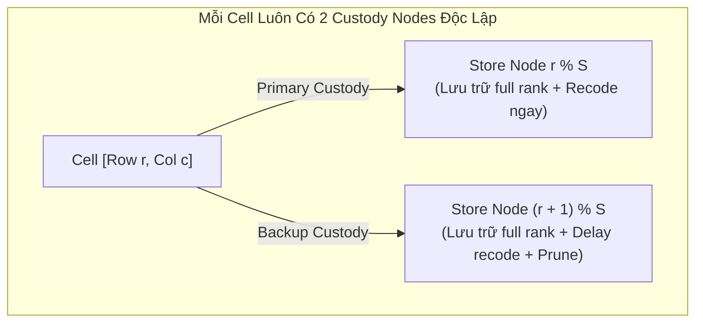

# Báo Cáo Kỹ Thuật: Vấn Đề Định Tuyến & Phát Tán Khi Có Đa Store Node Trên Cùng Vị Trí (Multi-Replica Store Nodes)

**Ngày lập:** 2026-09-15  
**Phạm vi:** `cda-bootstrap-node`, `cda-store-node`, `cda-light-node`, `cda-p2p`  
**Mức độ ảnh hưởng:** **Cao (High)** đối với kịch bản mở rộng mạng lưới có nhiều hơn 1 node trên một tọa độ hàng (`Row`).

---

## 1. Tổng Quan Vấn Đề (Executive Summary)

Trong kiến trúc mạng **CDA Network**, một mạng cột (`Column Network`) được chia thành $S$ vị trí tương ứng với các chỉ số dòng `rowIdx \in [0, S-1]$ (trong đó $S = \text{storesPerCol}$).

Tài liệu này ghi nhận và phân tích các vấn đề kỹ thuật phát sinh khi triển khai **$\ge 2$ Store Node cùng chia sẻ một vị trí dòng** (ví dụ: nhiều container chạy cùng tham số `-row 0`, `-col 0` với mục đích tạo bản sao dự phòng replica):
1. **Lỗi định tuyến phân phối seed tại Bootstrap Node:** Thuật toán xác định node nhận mảnh seed bị trượt chỉ số, phát nhầm dữ liệu của dòng này cho node ở dòng khác.
2. **Xung đột vai trò Primary / Backup tại Store Node:** Không có cơ chế bầu chọn (Leader Election) khiến tất cả các node cùng vị trí đồng thời hành xử như Primary, gây lãng phí tài nguyên tính toán.
3. **Cơ chế kênh phát tán hiện hành (Per-Node vs Per-Cell):** Kênh phát tán không được chia sẻ theo cell mà chia sẻ theo danh tính `PeerID` (`TopicNode(peerID)`), dẫn đến việc mỗi bản sao tự mở một kênh riêng biệt.
4. **Nguy cơ quá tải Bootstrap Node và bùng nổ Mesh GossipSub:** Khi số lượng Store Node tăng đột biến mà không có cơ chế phân cụm (clustering), tải I/O stream tại Bootstrap và số lượng topic GossipSub chéo sẽ tăng theo cấp số nhân.

---

## 2. Phân Tích Kỹ Thuật Chi Tiết (Technical Root Cause Analysis)

### 2.1 Lỗi Lệch Tọa Độ Khi Bootstrap Seeding (`GetPeersForCell`)

Tại file [`cda-bootstrap-node/internal/p2p/receiver.go`](file:///home/ubuntu/cda-network/cda-bootstrap-node/internal/p2p/receiver.go#L405-L444), hàm `GetPeersForCell` chịu trách nhiệm chỉ định Store Node nào sẽ nhận mảnh seed cho ô `[row, col]`:

```go
func (rcv *Receiver) GetPeersForCell(row, col int, pieceIdx int) []p2pcommon.PeerInfo {
    ...
    // 1. Thu thập toàn bộ node đang active trong cột
    var colPeers []p2pcommon.PeerInfo
    for _, info := range rcv.activePeers {
        colPeers = append(colPeers, info)
    }

    // 2. Sắp xếp mảng theo toạ độ Row
    sort.Slice(colPeers, func(i, j int) bool {
        return colPeers[i].Row < colPeers[j].Row
    })

    // 3. Tính toán node đích
    primaryIdx := row % len(colPeers)
    isBackup := (pieceIdx / kVal) > 0

    var targetIdx int
    if isBackup {
        targetIdx = (primaryIdx + 1) % len(colPeers)
    } else {
        targetIdx = primaryIdx
    }

    targetPeer := colPeers[targetIdx]
    return []p2pcommon.PeerInfo{targetPeer}
}
```

#### Nguyên nhân lỗi khi có $\ge 2$ node cùng dòng:
- Giả sử một cột có $S = 4$ vị trí dòng (`Row 0..3`), nhưng mỗi dòng có 2 node replica $\to \text{len}(colPeers) = 8$.
- Danh sách sau khi `sort.Slice` có dạng:
  $$\text{colPeers} = [N_{0,A}, N_{0,B}, N_{1,A}, N_{1,B}, N_{2,A}, N_{2,B}, N_{3,A}, N_{3,B}]$$
- Khi Bootstrap phân phối seed cho **Dòng 1** (`row = 1`):
  $$\text{primaryIdx} = 1 \pmod 8 = 1 \implies \text{colPeers}[1] = N_{0,B}$$
- **Hậu quả:** Mảnh dữ liệu thuộc **Dòng 1** lại bị Bootstrap gửi sang $N_{0,B}$ (vốn là node đăng ký phụ trách **Dòng 0**). Khi nhận được, $N_{0,B}$ sẽ xác định đây là ô non-custody, không nhận đủ $k_{\text{piece}}$ mảnh và làm đứt gãy hoàn toàn luồng lưu trữ custody của Dòng 1.

---

### 2.2 Xung Đột Quyết Định Vai Trò Primary / Backup Tại Store Node

Tại file [`cda-store-node/internal/p2p/receiver.go`](file:///home/ubuntu/cda-network/cda-store-node/internal/p2p/receiver.go#L600-L603):

```go
isPrimary := (row % rcv.storesPerCol) == rcv.rowIdx
isBackup  := ((row + 1) % rcv.storesPerCol) == rcv.rowIdx
isCustody := isPrimary || isBackup
```

#### Hiện tượng:
- Cả hai node $N_{0,A}$ và $N_{0,B}$ đều mang `rowIdx = 0`.
- Khi ô `[0, col]` đến, **cả hai node đều tự nhận là Primary**.
- Không có cơ chế điều phối (Leader Election / Token Ring / Consistent Hashing).
- Cả hai node sẽ:
  1. Độc lập chờ gom đủ rank $k_{\text{piece}}$.
  2. Độc lập tính toán recoding (tiêu hao CPU gấp đôi).
  3. Độc lập broadcast lên kênh riêng của từng node (`TopicNode(PeerA)` và `TopicNode(PeerB)`).

---

### 2.3 Mô Hình Kênh Phát Tán: Kênh Per-Node vs Kênh Per-Cell

Hệ thống **không sử dụng kênh theo cell (Cell-based topic)** để phát tán seed từ Store Node. Kiến trúc đã chuyển đổi hoàn toàn sang **Per-Node Dedicated Channels** (tham khảo [per_node_channels_migration.md](file:///home/ubuntu/cda-network/docs/system/system_architecture/per_node_channels_migration.md)):

```mermaid
graph LR
    subgraph "Bootstrap Seeding (Unicast)"
        BOOT["Bootstrap Node"] -->|ProtoNodeSeed(PeerA)| SA["Store Node A<br/>(/cda/store/PeerA/seed/1.0.0)"]
        BOOT -->|ProtoNodeSeed(PeerB)| SB["Store Node B<br/>(/cda/store/PeerB/seed/1.0.0)"]
    end

    subgraph "Custody Dissemination (GossipSub)"
        SA -->|TopicNode(PeerA)| TOPIC_A["/cda/1.0.0/node/PeerA"]
        SB -->|TopicNode(PeerB)| TOPIC_B["/cda/1.0.0/node/PeerB"]
    end

    subgraph "Non-Custody Subscribers"
        TOPIC_A --> SC["Store Node C (Subscribed)"]
        TOPIC_B --> SD["Store Node D (Subscribed)"]
    end
```

| Loại Giao Tiếp | Giao Thức / Topic | Đặc Tính | Có Dùng Chung Giữa Các Bản Sao? |
| :--- | :--- | :--- | :---: |
| **Bootstrap $\to$ Store (Seed)** | `ProtoNodeSeed(peerID)` | Libp2p stream trực tiếp (Unicast) | **KHÔNG** (Mỗi node 1 protocol theo PeerID) |
| **Store $\to$ Network (Recoded)** | `TopicNode(peerID)` | GossipSub per-node topic | **KHÔNG** (Mỗi node 1 topic theo PeerID) |
| **Anchor Commitments** | `TopicCol(colIdx)` | GossipSub per-column topic | **CÓ** (Dùng chung cho cả cột, chỉ truyền Merkle proof) |
| **Light Node DAS Query** | `ProtoStoreFetch` | Libp2p request/response | **CÓ** (Light node shuffle và truy vấn bất kỳ node nào) |

Do các kênh gắn liền với danh tính mật mã `PeerID`, các node bản sao tại cùng vị trí **không dùng chung kênh phát tán**, mà tạo ra nhiều kênh song song chứa dữ liệu tương đương nhau.

---

### 2.4 Gánh Nặng Mạng Lưới & Điểm Nghẽn Khi Quy Mô Store Node Quá Lớn

Nếu tăng số lượng Store Node quá nhiều mà không có cơ chế phân tầng:

1. **Nghẽn I/O tại Bootstrap Node:**
   - Bootstrap phải mở stream unicast tới từng Store Node.
   - Dù có semaphore kiểm soát đồng thời 16 stream (`sem := make(chan struct{}, 16)`), hàng đợi stream sẽ bị nghẽn (backpressure), làm tăng độ trễ phát tán block.
2. **Bùng nổ Topic GossipSub Mesh:**
   - Hàm `subscribeToNonCustodyCells` khiến mỗi Store Node phải subscribe vào 2 topic `TopicNode(custodyPeerID)` cho từng dòng non-custody.
   - Khi có $S$ store node, số lượng subscription chéo giữa các container trong mạng Docker bridge `cda-net` tăng vọt, tiêu tốn CPU xử lý gói tin gossip heartbeat của libp2p.
3. **Cơ chế phòng vệ hiện có:**
   - Non-custody node sau khi thu thập đủ $\ge 2$ mảnh từ 2 nguồn khác nhau sẽ recode thành 1 mảnh duy nhất, xóa mảnh thô (`PruneRawPieces`), khóa ô (`nonCustodyLocked`), từ chối nhận thêm mảnh và **tuyệt đối không broadcast lại lên GossipSub**, giúp ngăn chặn nguy cơ bão phát tán (Broadcast Storm).

---

## 3. Kiến Trúc Dự Phòng Hiện Tại Của Hệ Thống (Current Redundancy Model)

Hệ thống CDA Network đã tích hợp sẵn cơ chế dự phòng dung lỗi $N+1$ (Fault Tolerance) mà **không cần chạy trùng toạ độ dòng**:



- Bất kỳ khi nào 1 Store Node gặp sự cố (Crash / Offline), node Backup ở vị trí kế tiếp vẫn duy trì đầy đủ dữ liệu để phục vụ truy vấn của Light Node.
- Tính năng này đã được kiểm chứng thành công trong kịch bản kiểm thử phục hồi lỗi (Scenario 1 Resilience Check trong `scripts/tests/run_docker_test.sh`).

---

## 4. Giải Pháp & Khuyến Nghị Kiến Trúc (Recommendations & Roadmap)

### 4.1 Khuyến Nghị Vận Hành Ngắn Hạn (Cho Kế Hoạch Docker E2E)
> [!IMPORTANT]
> **Quy ước thiết lập cấu hình:**
> - Mỗi container Store Node phải được gán một chỉ số dòng duy nhất: `rowIdx \in [0, \text{storesPerCol}-1]`.
> - Không cấu hình nhiều container có cùng giá trị `-row` trên cùng một cột `-col`.
> - Khi muốn mở rộng năng lực lưu trữ và thử nghiệm tải lớn, tăng trực tiếp tham số `--stores-per-col` ($S$) và `--cols` ($N$).

### 4.2 Đề Xuất Cải Tiến Dài Hạn (Hỗ Trợ Multi-Replica Cho Cùng Một Vị Trí)
Nếu muốn hỗ trợ mô hình nhiều node vật lý cùng đóng vai trò replica cho một vị trí dòng `rowIdx`:

1. **Cải tiến `GetPeersForCell` tại Bootstrap Node:**
   - Nhóm danh bạ `activePeers` theo `Row`: `map[int][]PeerInfo`.
   - Lựa chọn node trong nhóm theo cơ chế Round-Robin hoặc Consistent Hash dựa trên `BlockID` để chia tải seeding giữa các replica.
2. **Cơ chế Leader Election / Active-Passive tại Store Node:**
   - Trong các node cùng `rowIdx`, node có `PeerID` nhỏ nhất theo hash sẽ đóng vai trò **Active Primary** (thực hiện recode và broadcast).
   - Node replica còn lại đóng vai trò **Passive Standby** (chỉ lưu custody và phục vụ query khi được yêu cầu, không broadcast trùng lặp lên GossipSub).
3. **Kênh Nhóm Cột (Clustered Topics):**
   - Thay thế việc mỗi node mở 1 topic riêng bằng việc gom các node cùng vị trí vào một topic chung có định danh vị trí: `/cda/1.0.0/col/<col>/row/<row>`.
