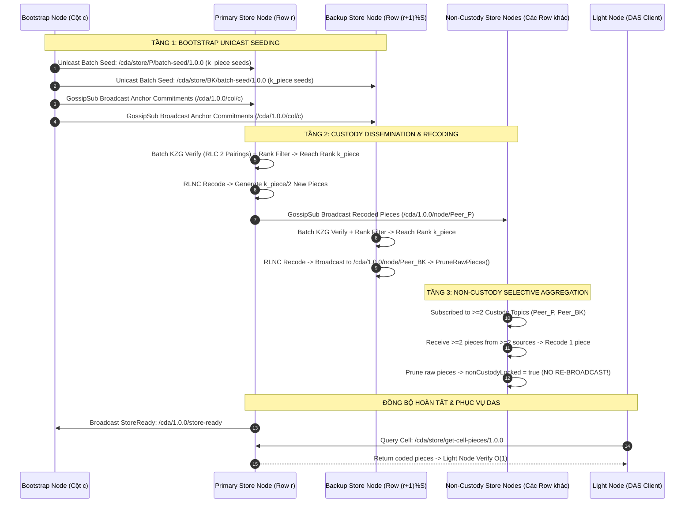

# ĐẶC TẢ CHI TIẾT CÁC NODE VÀ CƠ CHẾ LAN TRUYỀN MA TRẬN MẠNG STORE NODE (CDA NETWORK)

> **Tài liệu:** Kiến trúc chi tiết các Node, Tối ưu hóa tính toán Concurrency & Phân tích điểm nghẽn lan truyền ma trận mạng Store Node  
> **Phiên bản:** 2.0 (Hỗ trợ cấu hình tách biệt $K$ và $k_{\text{piece}}$, Tối ưu ma trận quy mô lớn $K=16, 32, 64$)  
> **Trọng tâm kỹ thuật:** Cơ chế lan truyền dữ liệu ma trận 2D Store Node, Hiện tượng nghẽn mạng P2P và các giải pháp tối ưu hóa đồng thời.

---

## MỤC LỤC

1. [TỔNG QUAN KIẾN TRÚC MA TRẬN 2D VÀ PHÂN CẤP NODE](#i-tổng-quan-kiến-trúc-ma-trận-2d-và-phân-cấp-node)
2. [ĐẶC TẢ CHI TIẾT TỪNG LOẠI NODE TRONG HỆ THỐNG](#ii-đặc-tả-chi-tiết-từng-loại-node-trong-hệ-thống)
   - [1. Publisher Node (Khởi tạo khối & Cổng kiểm soát)](#1-publisher-node-khởi-tạo-khối--cổng-kiểm-soát)
   - [2. Bootstrap Node (Xác thực, Tạo hạt giống & Định tuyến)](#2-bootstrap-node-xác-thực-tạo-hạt-giống--định-tuyến)
   - [3. Store Node (Lưu trữ Custody, Recoding & Phục vụ DAS)](#3-store-node-lưu-trữ-custody-recoding--phục-vụ-das)
   - [4. Light Node / Verifier Node (Kiểm định mẫu khả dụng dữ liệu - DAS)](#4-light-node--verifier-node-kiểm-định-mẫu-khả-dụng-dữ-liệu---das)
3. [TRỌNG TÂM: CƠ CHẾ LAN TRUYỀN DỮ LIỆU MA TRẬN MẠNG STORE NODE](#iii-trọng-tâm-cơ-chế-lan-truyền-dữ-liệu-ma-trận-mạng-store-node)
   - [1. Luồng Lan Truyền Dữ Liệu 3 Tầng (3-Tier Propagation Flow)](#1-luồng-lan-truyền-dữ-liệu-3-tầng-3-tier-propagation-flow)
   - [2. Phân Tích Chuyên Sâu Các Điểm Nghẽn Cốt Lõi (Bottleneck Root Causes)](#2-phân-tích-chuyên-sâu-các-điểm-nghẽn-cốt-lõi-bottleneck-root-causes)
   - [3. Các Kỹ Thuật Đã Hiện Thực Để Hóa Giải Điểm Nghẽn](#3-các-kỹ-thuật-đã-hiện-thực-để-hóa-giải-điểm-nghẽn)
   - [4. Bảng Ma Trận Cấu Hình Tinh Chỉnh Tối Ưu (Optimal Parameter Matrix)](#4-bảng-ma-trận-cấu-hình-tinh-chỉnh-tối-ưu-optimal-parameter-matrix)
4. [TỔNG HỢP GIAO THỨC PROTOBUF, P2P STREAMS & PUBSUB TOPICS](#iv-tổng-hợp-giao-thức-protobuf-p2p-streams--pubsub-topics)
5. [ĐỊNH HƯỚNG TỐI ƯU HÓA DÀI HẠN (NEXT-GEN ROADMAP)](#v-định-hướng-tối-ưu-hóa-dài-hạn-next-gen-roadmap)

---

## I. TỔNG QUAN KIẾN TRÚC MA TRẬN 2D VÀ PHÂN CẤP NODE

Mạng lưới **CDA (Coded Data Availability)** tổ chức không gian lưu trữ và kiểm định dữ liệu dưới dạng **Ma trận 2 chiều ($2K \times 2K$)** dựa trên mã hóa sửa sai hai chiều Reed-Solomon (2D Reed-Solomon) kết hợp mã hóa mạng tuyến tính ngẫu nhiên (Random Linear Network Coding - RLNC) và cam kết mật mã đa thức KZG (Kate-Zaverucha-Goldberg).

```
   ┌────────────────────────────────────────────────────────────────────────┐
   │                           KHỐI DỮ LIỆU GỐC                             │
   │               ODS (Original Data Square): K × K Cells                  │
   └───────────────────────────────────┬────────────────────────────────────┘
                                       │ Mở rộng 2D Reed-Solomon (IFFT / FFT)
                                       ▼
   ┌────────────────────────────────────────────────────────────────────────┐
   │                         KHỐI DỮ LIỆU MỞ RỘNG                           │
   │               EDS (Extended Data Square): 2K × 2K Cells                │
   │                                                                        │
   │       Subnet Cột 0          Subnet Cột 1         ...   Subnet Cột Nc-1 │
   │   Row 0   [Cell 0,0]           [Cell 0,1]        ...      [Cell 0, n-1]│
   │   Row 1   [Cell 1,0]           [Cell 1,1]        ...      [Cell 1, n-1]│
   │   ...         ...                  ...           ...           ...     │
   │   Row n-1 [Cell n-1,0]         [Cell n-1,1]      ...    [Cell n-1, n-1]│
   └────────────────────────────────────────────────────────────────────────┘
```

### 1. Phân Vùng Ma Trận Mạng (Subnet Decomposition)
- **Kích thước khối**: Ma trận gốc $K \times K$, mở rộng thành ma trận EDS $n \times n$ với $n = 2K$.
- **Mạng Cột (Column Subnets)**: Được chia thành $N_c$ cột mạng logic (`numCols`). Mỗi cột mạng được quản lý và định tuyến bởi một **Bootstrap Node**. Số lượng cột dữ liệu EDS mà một Bootstrap Node phụ trách là:
  $$\text{colsPerNetCol} = \frac{n}{N_c} = \frac{2K}{\text{numCols}}$$
- **Nhóm Lưu Trữ Cột (Column Store Nodes)**: Trong mỗi cột mạng, có $S$ Store Nodes (`storesPerCol`), được gán các chỉ số dòng cục bộ $\text{rowIdx} \in [0, S-1]$.

### 2. Thuật Toán Gán Ô Tọa Độ Tự Động (Verifiable Custody Assignment)
Mỗi Store Node $P$ khởi tạo danh tính bằng cặp khóa Ed25519, sinh ra `PeerID`. Tọa độ lưu trữ $(r, c)$ được gán tất định và có thể xác minh công khai qua hàm băm mật mã:
$$\text{Hash}(P) = \text{Blake3}(\text{PeerID} \parallel \text{NetworkSalt})$$
$$r = \text{Hash}(P) \pmod{n} \quad (\text{Hàng } r), \qquad c = \text{Hash}(P) \pmod{n} \quad (\text{Cột } c)$$

### 3. Phân Định Quyền Hạn Lưu Trữ (Custody Roles)
Đối với ô dữ liệu tại vị trí $[\text{row}, \text{col}]$ thuộc cột quản lý của Store Node mang chỉ số `rowIdx`:
- **Primary Custody (Lưu trữ chính)**: Thỏa mãn điều kiện:
  $$\text{row} \pmod S == \text{rowIdx}$$
  *Nhiệm vụ*: Bắt buộc lưu trữ vĩnh viễn $\ge k_{\text{piece}}$ mảnh RLNC độc lập tuyến tính, tính toán tái mã hóa (RLNC Recoding) và phát tán mảnh mới lên mạng lưới ngay khi đạt Full Rank.
- **Backup Custody (Lưu trữ dự phòng)**: Thỏa mãn điều kiện:
  $$(\text{row} + 1) \pmod S == \text{rowIdx}$$
  *Nhiệm vụ*: Tiếp nhận và lưu tạm thời hạt giống từ Bootstrap Node. Hỗ trợ dự phòng khi Primary gặp sự cố, phát tán mảnh recoded hỗ trợ mạng rồi kích hoạt dọn dẹp (`PruneRawPieces`) để tối ưu dung lượng đĩa và RAM.
- **Non-Custody (Ô không thuộc quyền quản lý)**: Tất cả các dòng còn lại trong cột ($\text{row} \pmod S \ne \text{rowIdx}$ và $(\text{row} + 1) \pmod S \ne \text{rowIdx}$).
  *Nhiệm vụ*: Thu thập tối thiểu 2 mảnh từ 2 nguồn độc lập qua GossipSub, tái mã hóa thành 1 mảnh duy nhất, dọn dẹp mảnh thô, khóa ô (`nonCustodyLocked`) và **tuyệt đối không phát tán tiếp** để chống bão lan truyền.

---

## II. ĐẶC TẢ CHI TIẾT TỪNG LOẠI NODE TRONG HỆ THỐNG

```
========================================================================================================================
                                            KIẾN TRÚC 4 TẦNG NODE TRONG CDA NETWORK
========================================================================================================================

  [ TẦNG 1: PUBLISHER NODE ]
        │  • Input: ODS K×K. Compute: 2D Reed-Solomon -> EDS 2K×2K, KZG Piece Commitments, Column Commitments.
        │  • Gate: Sequential Publish Gate, Wait StoreReady -> Broadcast BlockReady.
        │
        ├─── Broadcast BlockHeader ──────────────────────────────────────► GossipSub: `/cda/1.0.0/header`
        └─── Unicast Column Chunks (`/cda/publisher/push-chunk/1.0.0`) ─► [ TẦNG 2: BOOTSTRAP NODES ] (Mỗi Cột 1 Node)
                                                                                  │
        ┌─────────────────────────────────────────────────────────────────────────┴────────────────────────┐
        ▼                                                                                                  ▼
  [ PHASE 1: FAST COMMITMENT BROADCAST ]                                             [ PHASE 2: COMPUTE & RLNC SEEDING ]
  • Verify Merkle Proof & Fiat-Shamir vs C_col                                       • Compute FK20 / KZG Opening Proofs
  • Broadcast GossipSub: `/cda/1.0.0/col/{c}`                                        • Encode RLNC: 2 * k_piece seeds per Row
  • Data: Commitments C_{c,0}..C_{c,k-1} + Proofs                                    • Dispatch Batches: `/cda/store/{peerID}/batch-seed/1.0.0`
        │                                                                                                  │
        └────────────────────────────────────────┬─────────────────────────────────────────────────────────┘
                                                 ▼
                                   [ TẦNG 3: STORE NODES MATRIX ]
                                   (Mỗi Cột gồm S Store Nodes [Row 0..S-1])
        ┌────────────────────────────────────────┴─────────────────────────────────────────────────────────┐
        ▼                                                                                                  ▼
  [ PRIMARY CUSTODY (r % S == rowIdx) ]                                              [ BACKUP CUSTODY ((r+1)%S == rowIdx) ]
  • Receive Seeds -> Batch KZG Verify (RLC 2 pairings)                              • Receive Backup Seeds -> Batch KZG Verify
  • Rank Filter (Gaussian Elimination)                                              • Rank Filter -> Reach Rank k_piece
  • Reach Rank k_piece -> Recode k_piece/2 pieces                                   • Recode & Broadcast -> PruneRawPieces
  • Broadcast to dedicated topic: `/cda/1.0.0/node/{peerID}`                        • Support Fallback Pull for Primary
        │                                                                                                  │
        └────────────────────────────────────────┬─────────────────────────────────────────────────────────┘
                                                 ▼
                                   [ NON-CUSTODY CELLS (Các dòng khác) ]
                                   • Subscribed to >=2 Custody Node Topics
                                   • Receive >=2 pieces from >=2 sources -> Recode 1 piece
                                   • Prune raw pieces -> Lock Cell (No re-broadcast!)
                                   • When all custody cells complete -> Send StoreReady `/cda/1.0.0/store-ready`
                                                 ▲
                                                 │ P2P Queries: `/cda/store/get-cell-pieces/1.0.0`
                                                 │
                                   [ TẦNG 4: LIGHT / VERIFIER NODES ]
                                   • Listen `/cda/1.0.0/block-ready` -> Trigger Auto-DAS
                                   • Query Random Cells [r, c] via Bootstrap Routing
                                   • Algebraic Invert (Gauss) & Verify O(1) with C_col
========================================================================================================================
```

---

### 1. Publisher Node (Khởi tạo khối & Cổng kiểm soát)

Publisher Node là cổng tiếp nhận dữ liệu từ tầng thực thi (Rollup Sequencer / Block Producer), chịu trách nhiệm mã hóa mở rộng, thiết lập cam kết mật mã và kiểm soát nhịp độ phát hành khối vào mạng lưới.

#### 1.1 Nhiệm Vụ & Công Việc Tính Toán Chi Tiết
1. **Tiếp nhận & Giải mã ODS (Original Data Square)**:
   - Dữ liệu đầu vào gồm $K \times K$ phần tử trường hữu hạn $\mathbb{F}_r$ trên đường cong BLS12-381 (kích thước mỗi ô 32 bytes hoặc 64 bytes).
2. **Mã hóa mở rộng hai chiều 2D Reed-Solomon (Leopard / FFT-based Codec)**:
   - *Mở rộng theo Hàng*: Áp dụng phép biến đổi IFFT trên $K$ ô dữ liệu gốc của từng hàng, đệm $K$ số 0 (Zero-Padding) và áp dụng FFT để sinh ra $2K$ ô cho hàng đó.
   - *Mở rộng theo Cột*: Lặp lại quy trình IFFT $\to$ Zero-Pad $\to$ FFT trên các cột của ma trận đã mở rộng hàng để thu được ma trận hoàn chỉnh EDS kích thước $2K \times 2K$.
3. **Tính toán Cam kết Đa thức KZG (KZG Polynomial Commitments)**:
   - Với mỗi cột $c \in [0, 2K-1]$, chia cột thành $k_{\text{piece}}$ mảnh logic.
   - Tính toán cam kết mảnh $C_{c, j} = [p_j(\tau)]_1 = \sum_{i=0}^{\text{deg}} d_{i, j} [s_i]_1$ sử dụng thuật toán nhân đa vô hướng Pippenger MSM (Multi-Scalar Multiplication).
   - Xây dựng Cây Merkle từ các $C_{c, j}$ để sinh ra mã băm gốc `commits_root`.
   - Sinh vector ngẫu nhiên Fiat-Shamir toàn cục $x = \text{Hash}(\text{commits\_root} \parallel \text{BlockID})$.
   - Tính toán cam kết tổ hợp cột $C^{\text{col}}_c = \sum_{j=0}^{k_{\text{piece}}-1} x_j \cdot C_{c, j}$.
4. **Cổng kiểm soát tuần tự khối (Sequential Completion Gate)**:
   - Đảm bảo Block $H$ không được phép phát tán vào mạng nếu Block $H-1$ chưa được các Store Node hoàn thành 100% custody (`latestCompletedHeight < H-1`).
   - Tổng hợp các tín hiệu `StoreReady` từ GossipSub: khi đủ $S$ Store Nodes của tất cả $A$ active columns báo hoàn thành, Publisher phát tín hiệu `BlockReady` giải phóng Light Node lấy mẫu DAS và giải phóng Block $H+1$.

#### 1.2 Cấu Hình Tối Ưu Hóa Tính Toán (Concurrency & Parallelism)
- **`CommitEDS` Worker Pool**: Sử dụng worker pool với số luồng `runtime.NumCPU()` (tối đa 16 workers) tại [`rlnc-rsmt2d/cda/kzg.go`](file:///home/ubuntu/cda-network/rlnc-rsmt2d/cda/kzg.go). Giúp song song hóa việc tính $N \times k_{\text{piece}}$ cam kết KZG trên toàn bộ các lõi CPU của máy chủ, giảm thời gian sinh cam kết từ ~2.5s xuống dưới 250ms ở $K=64$.
- **Song song hóa gom cột (`colWg`)**: Sử dụng $N = 2K$ goroutines độc lập để tính toán đồng thời các cam kết cột $C^{\text{col}}_c$.
- **Pipeline gối đầu phi khóa (`ProcessODS`)**: Tách biệt luồng tính toán CPU (ODS/EDS encoding) và luồng I/O mạng (P2P dispatch). Cho phép Block $H+1$ bắt đầu mã hóa ngay khi Block $H$ bắt đầu truyền tải.
- **Giới hạn Block In-Flight**: Cấu hình biến môi trường `PUBLISHER_MAX_IN_FLIGHT=2` để ngăn hiện tượng tràn bộ nhớ đệm RAM khi Sequencer đẩy khối dồn dập.

#### 1.3 Thiết Lập Mạng (Kênh & Kết Nối)
- **Cổng Dịch Vụ HTTP**:
  - `POST /publish`: Endpoint nhận ODS data dạng hex.
  - `GET /header/{blockID}`: Endpoint phục vụ tải trực tiếp Block Header.
  - `GET /health`: Health check endpoint.
- **Kênh PubSub (GossipSub Topics)**:
  - **Publish**:
    - `/cda/1.0.0/header`: Broadcast cấu trúc `BlockHeader` Protobuf (~13 KB) chứa `commits_root`, danh sách $C^{\text{col}}_c$ và vector Fiat-Shamir $x$.
    - `/cda/1.0.0/block-ready`: Broadcast gói tin xác nhận 100% Store Nodes đã hoàn tất lưu trữ, kích hoạt Light Node DAS.
  - **Subscribe**:
    - `/cda/1.0.0/store-ready`: Thu thập các payload `GossipStoreReadyPayload` phát đi từ các Store Node để tổng hợp trạng thái hoàn thành cột và khối.
- **Kết Nối P2P Outbound Stream**:
  - Khởi tạo P2P Host với Ed25519 deterministic seed `"cda-publisher"`.
  - Mở đồng thời $N_c$ P2P streams giao thức `/cda/publisher/push-chunk/1.0.0` để unicast chunk dữ liệu cột, Merkle proofs và các cam kết sang từng Bootstrap Node tương ứng.

---

### 2. Bootstrap Node (Xác thực, Tạo hạt giống & Định tuyến)

Bootstrap Node đóng vai trò là "Thủ lĩnh cột" (Column Leader). Mỗi Bootstrap Node chịu trách nhiệm cho một nhóm cột mạng, đóng vai trò cầu nối xác thực mật mã giữa Publisher và các Store Node, đồng thời là hạ tầng định tuyến Discovery.

#### 2.1 Nhiệm Vụ & Công Việc Tính Toán Chi Tiết
Quá trình xử lý khi nhận chunk từ Publisher được tách làm 2 pha (2-Phase Pipeline):
1. **Phase 1: Fast Commitment Broadcast Layer (Độ trễ micro-seconds)**:
   - *Layer 1 Verification*: Xác minh tính hợp lệ của Merkle Proof cho từng cam kết mảnh $C_{c, j}$ đối chiếu với `commits_root`.
   - *Layer 2 Verification*: Kiểm tra tính nhất quán đại số Fiat-Shamir: $\sum_{j=0}^{k_{\text{piece}}-1} x_j \cdot C_{c, j} \stackrel{?}{=} C^{\text{col}}_c$.
   - *Fast Broadcast*: Ngay lập tức bắn gói tin cam kết mảnh và Merkle Proofs lên GossipSub topic `/cda/1.0.0/col/{colIdx}` để toàn bộ Store Nodes trong cột anchor trước trạng thái mà không cần chờ tính toán hạt giống.
2. **Phase 2: Compute & RLNC Seeding Layer (Xử lý nặng bất đồng bộ)**:
   - *Tính KZG Opening Proofs*: Sử dụng thuật toán FK20 hoặc đa thức chia `ComputeOpenProofCell` để sinh ra $N \times k_{\text{piece}}$ bằng chứng mở $\Pi_{j, r}$ cho từng ô $[r, c]$ trong cột.
   - *Mã hóa RLNC (Random Linear Network Coding)*: Với mỗi hàng $r \in [0, n-1]$, sinh $2 \times k_{\text{piece}}$ mảnh hạt giống độc lập ($k_{\text{piece}}$ mảnh phân phối cho Primary Store Node và $k_{\text{piece}}$ mảnh cho Backup Store Node). Mỗi mảnh bao gồm bộ ba $(d_i, g_i, \Pi_i)$ trong đó $d_i \in \mathbb{F}_r$ là payload dữ liệu mã hóa, $g_i \in \mathbb{F}_r^{k_{\text{piece}}}$ là vector hệ số ngẫu nhiên, và $\Pi_i$ là bằng chứng mở KZG tổ hợp.
   - *Phân phối Hạt giống (Per-Node Unicast Seeding)*: Đóng gói các mảnh hạt giống theo từng node đích và gửi trực tiếp qua stream P2P.
3. **Quản lý Peer Registry & Phục vụ Routing**:
   - Duy trì danh bạ `activePeers map[peer.ID]PeerInfo` với cơ chế kiểm tra TTL (15 giây).
   - Phục vụ RPC định tuyến cho Light Nodes và Store Nodes mới gia nhập mạng.

#### 2.2 Cấu Hình Tối Ưu Hóa Tính Toán
- **`BOOTSTRAP_PROOF_GEN_SEM`**: Semaphore giới hạn số goroutines đồng thời tính toán bằng chứng KZG (mặc định cấu hình từ 16 đến 32 trên máy 12 cores). Giúp ngăn ngừa việc mở đồng thời 256 goroutines tính toán nặng gây nghẽn CPU context-switch khi $K \ge 64$.
- **`BOOTSTRAP_SEEDING_SEM`**: Semaphore kiểm soát số lượng P2P stream kết nối đẩy dữ liệu tới Store Nodes (mặc định 64 streams đồng thời).
- **`BOOTSTRAP_BATCH_CHUNK_SIZE`**: Gom nhóm hạt giống thành từng batch (mặc định 64 seeds/batch request) khi gửi qua stream, giảm thiểu 90% chi phí bắt tay (handshake overhead) và phân mảnh frame của libp2p.
- **Pre-computation In-Flight Buffer**: Tính toán sẵn trước toàn bộ hạt giống của Block $H+1$ và giữ trong bộ đệm RAM. Ngay khi Store Nodes hoàn thành Block $H$, hạt giống Block $H+1$ được xả tức thì vào mạng mà không có bất kỳ độ trễ tính toán nào.

#### 2.3 Thiết Lập Mạng (Kênh & Kết Nối)
- **Keypair & Danh tính P2P**: Sinh từ seed tất định `"cda-bootstrap-{targetColStart}"` (ví dụ `cda-bootstrap-0`). Cho phép các node khác tự suy ra PeerID và Multiaddr của Bootstrap mà không cần cơ chế discovery bên ngoài.
- **Inbound Stream Handlers (Lắng nghe)**:
  - `/cda/publisher/push-chunk/1.0.0`: Tiếp nhận chunk dữ liệu và cam kết từ Publisher.
  - `/cda/bootstrap/routing/1.0.0`: Tiếp nhận yêu cầu đăng ký của Store Node (`BootstrapRoutingRequest`) và yêu cầu tra cứu định tuyến của Light Node.
- **Outbound P2P Streams (Chủ động mở)**:
  - `/cda/store/{peerID}/batch-seed/1.0.0`: Mở stream unicast trực tiếp tới từng Store Node đích để đẩy batch các mảnh hạt giống.
  - `/cda/store/{peerID}/seed/1.0.0`: Fallback stream gửi từng mảnh hạt giống đơn lẻ nếu batch bị lỗi.
- **Kênh PubSub (GossipSub Topics)**:
  - **Publish**: `/cda/1.0.0/col/{colIdx}`: Broadcast cam kết mảnh (Anchor payload) tới các Store Node thuộc cột quản lý.
  - **Subscribe**: `/cda/1.0.0/header`: Nhận header khối từ Publisher để kiểm tra tính nhất quán.

---

### 3. Store Node (Lưu trữ Custody, Recoding & Phục vụ DAS)

Store Node là hạt nhân lưu trữ và lan truyền phân tán của hệ thống CDA, đồng thời là **nơi tập trung khối lượng tính toán và lưu lượng mạng lớn nhất**, tạo nên điểm nghẽn chính của toàn bộ kiến trúc nếu không được thiết kế tối ưu.

```
   ┌────────────────────────────────────────────────────────────────────────┐
   │                          STORE NODE ARCHITECTURE                       │
   │                                                                        │
   │  [ Inbound Streams ]           [ GossipSub Channels ]                  │
   │  • /cda/store/{id}/batch-seed  • /cda/1.0.0/node/{id} (Dedicated Topic)│
   │  • /cda/store/batch-fetch      • /cda/1.0.0/col/{c}   (Anchor Topic)   │
   │  • /cda/store/get-cell-pieces  • /cda/1.0.0/row/{r}   (Row Subnet)     │
   │                                                                        │
   │                                   │                                    │
   │                                   ▼                                    │
   │              ┌──────────────────────────────────────────┐              │
   │              │   Sharded Cell Workers (NumCPU() * 2)    │              │
   │              │     Hash(cellKey) % NumWorkers Queue     │              │
   │              └────────────────────┬─────────────────────┘              │
   │                                   ▼                                    │
   │              ┌──────────────────────────────────────────┐              │
   │              │   Batch KZG Verification (RLC Pairing)   │              │
   │              │     Gom 48-96 Pieces -> 2 Pairings       │              │
   │              └────────────────────┬─────────────────────┘              │
   │                                   ▼                                    │
   │              ┌──────────────────────────────────────────┐              │
   │              │   Gaussian Rank Filter (Independence)    │              │
   │              │     IsLinearlyIndependent on Fr Field    │              │
   │              └────────────────────┬─────────────────────┘              │
   │                                   ▼                                    │
   │  ┌────────────────────────────────┴─────────────────────────────────┐  │
   │  ▼                                                                  ▼  │
   │ [ CUSTODY CELLS (Primary/Backup) ]        [ NON-CUSTODY CELLS ]        │
   │ • Rank >= k_piece -> Recode k_piece/2     • Gather >=2 pieces (>=2 src)│
   │ • Broadcast to TopicNode(selfPeerID)      • Recode 1 piece & Lock cell │
   │ • Backup Node: Prune raw pieces           • Prune raw pieces (No bcast)│
   │                                                                        │
   │                                   │                                    │
   │                                   ▼                                    │
   │              ┌──────────────────────────────────────────┐              │
   │              │   Debounced Block Completion Checker     │              │
   │              │   100% Custody Done -> Send StoreReady   │              │
   │              └──────────────────────────────────────────┘              │
   └────────────────────────────────────────────────────────────────────────┘
```

#### 3.1 Nhiệm Vụ & Công Việc Tính Toán Chi Tiết
1. **Tiếp Nhận & Xác Thực Hạt Giống (Batch KZG Verification)**:
   - Khi nhận các mảnh hạt giống (từ Bootstrap hoặc GossipSub), node phải kiểm tra tính hợp lệ của mảnh dữ liệu $d$ và bằng chứng $\Pi$ đối chiếu với cam kết tổ hợp $C_{\text{comb}} = \sum g_j \cdot C_j$.
   - **Đột phá RLC (Random Linear Combination)**: Thay vì gọi phép tính ghép cặp đường cong elliptic (Pairing) riêng rẽ cho từng mảnh ($2 \times M$ phép tính pairing với $M$ mảnh), hệ thống gom thành một batch $M$ mảnh và kiểm tra đồng thời:
     $$e\left(\sum_{i=1}^M \alpha_i \cdot \Pi_i, [\tau]_2\right) \stackrel{?}{=} e\left(\sum_{i=1}^M \alpha_i \cdot (C_{\text{comb}, i} - [d_i]_1) + \sum_{i=1}^M \alpha_i \cdot r_i \cdot \Pi_i, [1]_2\right)$$
     với $\alpha_i \in \mathbb{F}_r$ là hệ số ngẫu nhiên Fiat-Shamir. Toàn bộ batch chỉ tiêu tốn đúng **2 phép tính pairing duy nhất**!
2. **Lọc Hạng Ma Trận Độc Lập Tuyến Tính (Gaussian Elimination Rank Filter)**:
   - Khi nhận mảnh mới có vector hệ số $g_{\text{new}} \in \mathbb{F}_r^{k_{\text{piece}}}$, node đưa vào hàm `engine.IsLinearlyIndependent` thực hiện khử Gauss từng bước với các vector hệ số hiện có trong RAM.
   - Nếu $g_{\text{new}}$ phụ thuộc tuyến tính (không làm tăng hạng ma trận) $\implies$ Lập tức hủy bỏ (`Drop`), tránh lãng phí RAM và băng thông.
3. **Tái Mã Hóa P2P (RLNC Recoding)**:
   - Khi tích lũy đủ $k_{\text{piece}}$ mảnh độc lập tuyến tính (Full Rank), node sinh các hệ số ngẫu nhiên $\beta_i \in \mathbb{F}_r$, tính toán mảnh mã hóa mới qua số học trường Galois:
     $$d_{\text{recode}} = \sum_{i=1}^{k_{\text{piece}}} \beta_i d_i, \quad g_{\text{recode}} = \sum_{i=1}^{k_{\text{piece}}} \beta_i g_i, \quad \Pi_{\text{recode}} = \sum_{i=1}^{k_{\text{piece}}} \beta_i \Pi_i$$
   - Node Primary phát tán $k_{\text{piece}}/2$ mảnh recoded lên kênh dedicated `TopicNode(selfPeerID)`.
4. **Phục Hồi Dữ Liệu Chủ Động (Active Pull)**:
   - Khi một ô custody bị trượt gói tin qua GossipSub sau thời gian chờ `STORE_ACTIVE_PULL_DELAY_SEC`, node mở stream `/cda/store/batch-fetch/1.0.0` kết nối trực tiếp sang Backup Node để kéo bổ sung các mảnh thiếu.
5. **Dọn Dẹp Mảnh Thô (Pruning)**:
   - Các Backup Node và Non-Custody Node sau khi tái mã hóa xong sẽ kích hoạt `cache.PruneRawPieces` để xóa toàn bộ các mảnh dữ liệu thô, giải phóng tài nguyên bộ nhớ.

#### 3.2 Cấu Hình Tối Ưu Hóa Tính Toán (Concurrency & Worker Architecture)
Các thông số cấu hình concurrency tại [`cda-store-node/internal/p2p/receiver.go`](file:///home/ubuntu/cda-network/cda-store-node/internal/p2p/receiver.go):

| Tham số / Biến Môi Trường | Giá trị mặc định | Giải thích kỹ thuật & Tác động hiệu năng |
| :--- | :---: | :--- |
| `STORE_SHARDED_WORKERS` | `NumCPU() * 2` (24 workers trên 12 cores) | Hàng đợi worker phân mảnh theo hàm băm `hashCellKey(cellKey)`. Đảm bảo tất cả tác vụ của cùng một cell được xử lý tuần tự tuyệt đối trên 1 worker, triệt tiêu hoàn toàn race condition và tranh chấp khóa `cellMu`. |
| `Worker Queue Capacity` | `2000 tasks/chan` | Dung lượng đệm hàng đợi cho mỗi worker channel, ngăn ngừa tràn đệm khi dữ liệu dồn về đột biến. |
| `STORE_GOSSIP_BATCH_WORKERS` | `2` (tối đa 4) | Số luồng gom batch và gọi hàm `kzg.BatchVerify`. Được giữ ở mức 2-4 để thuật toán Pippenger MSM độc chiếm trọn vẹn L3 cache của CPU mà không gây tranh chấp luồng. |
| `STORE_GOSSIP_BATCH_SIZE` | `48` (tối ưu `64-96` ở $K \ge 64$) | Số lượng mảnh hạt giống tối đa được gom trong 1 batch trước khi kích hoạt xác thực RLC 2 pairings. |
| `STORE_GOSSIP_BATCH_TICKER_MS` | `10ms` | Thời gian timeout tối đa để xả batch nếu số lượng mảnh chưa đạt ngưỡng `batchSize`. |
| `STORE_DISSEMINATION_SEM` | `16` | Semaphore giới hạn số goroutines thực hiện recoding và broadcast đồng thời khi nhiều custody cells đạt full rank cùng lúc, ngăn ngừa bão phát tán làm nghẽn bộ đệm libp2p. |
| `STORE_FALLBACK_PULL_SEM` | `8` | Semaphore giới hạn số kết nối P2P kéo bù dữ liệu song song qua stream. |
| `completionCheckChan` | Buffer `1024`, Debounce `40ms` | Kênh gộp tín hiệu kiểm tra hoàn thành block. Gom hàng nghìn tín hiệu đến liên tục, chỉ chẩn đoán trạng thái block 40ms/lần, loại bỏ 99% chi phí tranh chấp khóa bộ nhớ. |

#### 3.3 Thiết Lập Mạng (Kênh Phải Mở & Kết Nối Cần Thiết Lập)
Store Node thiết lập cả kết nối trực tiếp (LibP2P Streams) và kết nối truyền thông nhóm (GossipSub PubSub):

##### A. Các Giao Thức P2P Streams Cần Lắng Nghe (Inbound Handlers)
1. `/cda/store/{peerID}/batch-seed/1.0.0`: Lắng nghe batch hạt giống từ Bootstrap Node.
2. `/cda/store/{peerID}/seed/1.0.0`: Lắng nghe hạt giống đơn lẻ từ Bootstrap Node.
3. `/cda/store/fetch-pieces/1.0.0`: Lắng nghe yêu cầu Active Pull từ Store Node khác trong cùng cột.
4. `/cda/store/batch-fetch/1.0.0`: Lắng nghe yêu cầu Batch Active Pull nhiều cell từ Store Node khác.
5. `/cda/store/get-cell-pieces/1.0.0`: Lắng nghe truy vấn DAS từ Light Nodes.

##### B. Các Kênh GossipSub Cần Đăng Ký (Topics Subscription)
1. `TopicCol(colIdx) = /cda/1.0.0/col/{colIdx}`: Đăng ký tất cả các cột dữ liệu thuộc phạm vi phụ trách (`startCol` đến `endCol - 1`) để tiếp nhận Cam kết mảnh (Anchor payload) từ Bootstrap.
2. `TopicNode(selfPeerID) = /cda/1.0.0/node/{selfPeerID}`: Đăng ký kênh riêng của chính mình để tiếp nhận các mảnh recoded gửi đích danh.
3. `TopicNode(custodyPeerID) = /cda/1.0.0/node/{peerID}`: Đăng ký chọn lọc tới **tối đa 2 custody nodes** của từng dòng non-custody (được xác lập thông qua hàm `subscribeToNonCustodyCells`).
4. `TopicRow(rowIdx) = /cda/1.0.0/row/{rowIdx}`: Đăng ký subnet hàng để discovery và duy trì heartbeat hàng ngang.
5. `/cda/1.0.0/header`: Đăng ký nhận Block Header từ Publisher.

##### C. Các Kênh GossipSub Cần Phát Tán (Topics Publish)
1. `TopicNode(selfPeerID)`: Phát tán các mảnh mã hóa mới (Recoded pieces) cho các ô Primary và Backup Custody.
2. `/cda/1.0.0/store-ready`: Phát tín hiệu `GossipStoreReadyPayload` báo cáo Publisher khi node hoàn thành 100% custody của khối.

##### D. Cơ Chế Chống Spam & Quản Lý Kết Nối
- **Token-Bucket Rate Limiter**: Kiểm soát tốc độ truy vấn trên từng kết nối stream theo `peer.ID` (hạn mức mặc định 1000 requests/giây, burst 1000) tại [`cda-store-node/internal/p2p/receiver.go`](file:///home/ubuntu/cda-network/cda-store-node/internal/p2p/receiver.go#L2425-L2450).
- **Graceful Shutdown**: Khi nhận tín hiệu SIGTERM/SIGINT, gửi bản tin `BootstrapRoutingRequest{IsLeave: true}` tới Bootstrap để lập tức rút lui khỏi danh bạ routing, tránh tình trạng các node khác gửi nhầm truy vấn vào node đã chết.

---

### 4. Light Node / Verifier Node (Kiểm định mẫu khả dụng dữ liệu - DAS)

Light Node là thành phần biên mỏng, đại diện cho ví người dùng, cầu nối Rollup (L2 Bridge) hoặc các full node muốn kiểm tra tính khả dụng dữ liệu (Data Availability) mà không cần tải hay lưu trữ toàn bộ khối.

#### 4.1 Nhiệm Vụ & Công Việc Tính Toán Chi Tiết
1. **Đồng Bộ Header Khối Nhẹ**:
   - Nhận Block Header (~13 KB) từ GossipSub topic `/cda/1.0.0/header`.
2. **Lấy Mẫu Xác Suất (Data Availability Sampling - DAS)**:
   - Tự động kích hoạt khi nhận tín hiệu `/cda/1.0.0/block-ready` hoặc qua REST API `/das/sample/{blockID}`.
   - Chọn ngẫu nhiên danh sách tọa độ $[r_i, c_i]$ trong ma trận EDS $2K \times 2K$ (ví dụ lấy 64 mẫu ngẫu nhiên để đạt độ tin cậy $99.9999999\%$).
3. **Truy Vấn Định Tuyến & Kéo Dữ Liệu**:
   - Truy vấn Bootstrap Node cột qua `/cda/bootstrap/routing/1.0.0` để lấy danh sách active Store Nodes tại cột $c_i$.
   - Mở P2P stream `/cda/store/get-cell-pieces/1.0.0` hoặc `/cda/store/batch-fetch/1.0.0` kéo $k_{\text{piece}}$ mảnh mã hóa RLNC từ Store Node.
   - Hỗ trợ cơ chế Fallback Retry tuần tự qua tối đa 3 Store Nodes dự phòng nếu node đầu tiên phản hồi lỗi hoặc timeout.
4. **Xác Thực Đại Số $O(1)$ (Algebraic Combined Verification)**:
   - Dùng khử Gauss nghịch đảo ma trận hệ số RLNC $A \in \mathbb{F}_r^{k_{\text{piece}} \times k_{\text{piece}}}$:
     $$S = A^{-1} \cdot d_{\text{pieces}}, \qquad \Pi = A^{-1} \cdot P_{\text{pieces}}$$
   - Tái lập dữ liệu ô gốc $S$ và bằng chứng mở KZG tổ hợp $\Pi$.
   - Gọi hàm `v.kzg.Verify` kiểm tra trực tiếp với cam kết cột $C^{\text{col}}_{c_i}$ với chi phí $O(1)$.

#### 4.2 Cấu Hình Tối Ưu Hóa Tính Toán & Thiết Lập Mạng
- **DAS Semaphore Concurrency**: Giới hạn tối đa 16 goroutines đồng thời gửi truy vấn P2P lấy mẫu (`make(chan struct{}, 16)`).
- **Kênh PubSub Lắng Nghe**:
  - `/cda/1.0.0/header`: Đồng bộ header khối.
  - `/cda/1.0.0/block-ready`: Lắng nghe tín hiệu kích hoạt tự động lấy mẫu (Auto-DAS).
- **Outbound Streams P2P**:
  - `/cda/bootstrap/routing/1.0.0`: Lấy danh sách Store Nodes.
  - `/cda/store/get-cell-pieces/1.0.0` & `/cda/store/batch-fetch/1.0.0`: Kéo dữ liệu mẫu.

---

## III. TRỌNG TÂM: CƠ CHẾ LAN TRUYỀN DỮ LIỆU MA TRẬN MẠNG STORE NODE

Lan truyền dữ liệu qua ma trận Store Node là **điểm nghẽn nghiêm trọng nhất của toàn bộ hệ thống CDA**. Sự kết hợp giữa quy mô ma trận lớn ($2K \times 2K$), số lượng mảnh mã hóa dày đặc và giao thức GossipSub đa kênh khiến hiệu năng hệ thống suy giảm nhanh chóng nếu không được quản lý chặt chẽ.

### 1. Luồng Lan Truyền Dữ Liệu 3 Tầng (3-Tier Propagation Flow)



#### Chi Tiết Từng Tầng Lan Truyền:
- **Tầng 1 (Bootstrap Unicast Seeding)**: Bootstrap không phát tán hạt giống qua GossipSub mà sử dụng dedicated P2P streams theo từng node (`ProtoNodeBatchSeed(peerID)`). Điều này triệt tiêu hoàn toàn hiện tượng bão hạt giống trên kênh chung.
- **Tầng 2 (Custody Dissemination & Recoding)**:
  - *Primary Node*: Tích lũy đủ $k_{\text{piece}}$ mảnh hạt giống độc lập $\implies$ Đạt Full Rank $\implies$ Sinh ngẫu nhiên $\beta_i \in \mathbb{F}_r$ để tái mã hóa thành $k_{\text{piece}}/2$ mảnh mới $\implies$ Phát tán lên dedicated topic `TopicNode(selfPeerID) = /cda/1.0.0/node/<peerID>`.
  - *Backup Node*: Đóng vai trò dự phòng nóng. Nhận $k_{\text{piece}}$ mảnh hạt giống từ Bootstrap, cũng thực hiện recode và phát tán hỗ trợ, sau đó **xóa sạch toàn bộ mảnh thô (`PruneRawPieces`)** để giải phóng bộ nhớ.
- **Tầng 3 (Non-Custody Selective Aggregation & Cell Locking)**:
  - Mỗi Non-custody node chỉ đăng ký theo dõi tối đa 2 custody nodes phụ trách dòng đó.
  - Ngay khi nhận đủ $\ge 2$ mảnh từ $\ge 2$ nguồn độc lập (`minPieces=2, minSources=2`), node tái mã hóa thành **đúng 1 mảnh đại diện** duy nhất.
  - Node xóa các mảnh thô, khóa ô (`nonCustodyLocked[cellKey] = true`), từ chối nhận thêm bất kỳ mảnh nào khác của ô này và **TUYỆT ĐỐI KHÔNG PHÁT TÁN LÊN GOSSIPSUB**, dập tắt hoàn toàn nguy cơ bão phát tán đệ quy.

---

### 2. Phân Tích Chuyên Sâu Các Điểm Nghẽn Cốt Lõi (Bottleneck Root Causes)

Trong quá trình thực nghiệm đo kiểm hiệu năng tại các mức ma trận $K=16, 32, 64$, hệ thống bộc lộ 6 nguyên nhân gốc rễ gây nghẽn:

#### 2.1 Bùng Nổ Mesh GossipSub & Phí Tổn Heartbeat Đa Kênh (Mesh Fan-Out Explosion)
- **Bản chất**: Khi quy mô ma trận tăng lên $K=64$, ma trận EDS có $128 \times 128 = 16.384$ ô. Với kiến trúc chia kênh theo node (`TopicNode(peerID)`), số lượng subscription chéo giữa các Store Node trong mạng Docker bridge tăng theo cấp số nhân ($O(S^2)$ trong mỗi cột).
- **Hậu quả**:
  - Giao thức LibP2P GossipSub duy trì các bản tin điều khiển chu kỳ (GossipSub Heartbeat mỗi 1 giây, trao đổi metadata `IHAVE`, `IWANT`, `GRAFT`, `PRUNE`).
  - Lượng gói tin điều khiển áp đảo lưu lượng dữ liệu thực tế, làm nghẽn hàng đợi mạng ảo của Linux Kernel và gây suy hao CPU nghiêm trọng cho việc xử lý bản tin heartbeat.

#### 2.2 Nghẽn Hàng Đợi Kết Nối I/O Stream Unicast (Dial Backpressure & Stream Backlog)
- **Bản chất**: Ở giai đoạn phân phối hạt giống, Bootstrap Node phải đồng thời mở stream unicast tới toàn bộ Store Nodes. Khi Store Nodes đang bận xử lý tính toán CPU hoặc mạng bị trễ, quá trình bắt tay P2P stream (`host.NewStream`) bị nghẽn (backpressure).
- **Hậu quả**: Các stream bị đẩy vào hàng đợi chờ hoặc bị timeout dial (sau 2-3 giây), dẫn đến việc các mảnh hạt giống không tới được Store Node đúng hạn, gây ra tình trạng thiếu mảnh cục bộ.

#### 2.3 Quá Tải Tính Toán Mật Mã Cặp Phép Ghép Cặp (KZG Pairing Compute Spike)
- **Bản chất**: Mỗi mảnh dữ liệu nhận được bắt buộc phải kiểm tra tính hợp lệ trước khi lưu trữ để chống tấn công đầu độc dữ liệu (Poisoning Attack).
- **Hậu quả**: Phép ghép cặp đường cong elliptic (Tate/Weil Pairing trên BLS12-381) tiêu tốn hàng mili-giây CPU. Nếu không có cơ chế gom batch hiệu quả mà xử lý từng mảnh đơn lẻ, hàng nghìn mảnh đổ về cùng lúc sẽ làm CPU chạm ngưỡng 100% liên tục, đẩy thời gian xử lý một khối lên hàng chục giây.

#### 2.4 Tranh Chấp Khóa Bộ Nhớ Cục Bộ (Mutex Lock Contention trên Cache)
- **Bản chất**: Trong các phiên bản ban đầu, các luồng tiếp nhận GossipSub, luồng Active Pull và luồng Dissemination cùng truy cập vào bộ nhớ đệm `CustodyStore` thông qua các khóa đồng bộ toàn cục (`sync.Mutex`).
- **Hậu quả**: Hàng chục goroutines rơi vào trạng thái nghẽn chờ khóa (Lock Waiting). Thời gian CPU tiêu tốn cho việc tranh chấp khóa (Lock Contention) lớn hơn nhiều so với thời gian tính toán thực tế.

#### 2.5 Hiệu Ứng Bão Kéo Bù (Thundering Herd Active Pull Cascades)
- **Bản chất**: Khi mạng có độ trễ nhẹ, các mảnh GossipSub đến chậm hơn bình thường. Khi hết thời gian ân hạn (`Grace Period`), các Store Node tưởng rằng dữ liệu bị thất lạc liền đồng thời kích hoạt cơ chế Active Pull (`/cda/store/fetch-pieces` hoặc `batch-fetch`) kéo chéo nhau.
- **Hậu quả**:
  - Hàng loạt stream P2P được mở dồn dập giữa các Store Node.
  - Kích hoạt cơ chế phòng vệ của bộ giới hạn tốc độ (`RateLimiter: Rejected batch fetch request`).
  - Gây sập băng thông cục bộ và kéo dài thời gian hoàn thành khối một cách không cần thiết.

#### 2.6 Xung Đột Định Tuyến Đa Bản Sao (Multi-Replica Conflict)
- **Bản chất**: Khi triển khai $\ge 2$ Store Node cùng chia sẻ một vị trí dòng (`rowIdx`) để dự phòng:
  - Cả 2 node đều tự nhận là Primary cho cùng một ô dữ liệu.
  - Cả 2 node cùng gom full rank, cùng độc lập tính toán recoding và cùng phát tán lên 2 kênh riêng biệt (`TopicNode(PeerA)` và `TopicNode(PeerB)`).
- **Hậu quả**: Nhân đôi khối lượng tính toán CPU và nhân đôi lưu lượng mạng GossipSub mà không đem lại giá trị tăng thêm về độ khả dụng dữ liệu.

---

### 3. Các Kỹ Thuật Đã Hiện Thực Để Hóa Giải Điểm Nghẽn

Nhằm khắc phục toàn diện các điểm nghẽn nêu trên, hệ sinh thái CDA Network đã triển khai đồng bộ các giải pháp kỹ thuật:

```
┌──────────────────────────────────────────────────────────────────────────────────────────────────┐
│                             BỘ GIẢI PHÁP HÓA GIẢI ĐIỂM NGHẼN MẠNG                                │
├──────────────────────────────┬───────────────────────────────────┬───────────────────────────────┤
│ Điểm Nghẽn Gốc Rễ            │ Kỹ Thuật Hiện Thực Cứu Cánh       │ Vị Trí Mã Nguồn / Cấu Hình    │
├──────────────────────────────┼───────────────────────────────────┼───────────────────────────────┤
│ 1. Tranh chấp khóa Cell      │ Sharded Cell Worker Pools         │ `receiver.go`                 │
│                              │ Băm cố định: Hash(cellKey) % N    │ `STORE_SHARDED_WORKERS`       │
├──────────────────────────────┼───────────────────────────────────┼───────────────────────────────┤
│ 2. Quá tải phép tính Pairing │ Batch KZG Verification via RLC    │ `receiver.go`, `kzg.go`       │
│                              │ Gom 48-96 mảnh -> 2 pairings duy  │ `STORE_GOSSIP_BATCH_SIZE`     │
│                              │ nhất qua tổ hợp ngẫu nhiên Fr     │ `STORE_GOSSIP_BATCH_WORKERS`  │
├──────────────────────────────┼───────────────────────────────────┼───────────────────────────────┤
│ 3. Bùng nổ P2P Stream Dial   │ Batch Chunk Seeding Streams       │ `cda-bootstrap-node`          │
│                              │ Gom 64 seeds / stream payload     │ `BOOTSTRAP_BATCH_CHUNK_SIZE`  │
│                              │ Khống chế stream đồng thời        │ `BOOTSTRAP_SEEDING_SEM=64`    │
├──────────────────────────────┼───────────────────────────────────┼───────────────────────────────┤
│ 4. Bão lan truyền GossipSub  │ Selective 2-Source Subscription & │ `receiver.go`                 │
│                              │ Cell Locking (nonCustodyLocked)   │ `subscribeToNonCustodyCells`  │
│                              │ Không bao giờ re-broadcast        │                               │
├──────────────────────────────┼───────────────────────────────────┼───────────────────────────────┤
│ 5. Bão kéo bù Thundering Herd│ Debounced Completion Check (40ms) │ `receiver.go`                 │
│                              │ + Token-Bucket Rate Limiter       │ `allowRequest` (1000 req/s)   │
│                              │ + Cooldown Grace Period (5 giây)  │ `STORE_ACTIVE_PULL_DELAY_SEC` │
├──────────────────────────────┼───────────────────────────────────┼───────────────────────────────┤
│ 6. Tràn RAM & Đĩa dữ liệu    │ Instant Raw Piece Pruning         │ `custody.go`, `receiver.go`   │
│                              │ Xóa ngay mảnh thô sau recode      │ `cache.PruneRawPieces`        │
└──────────────────────────────┴───────────────────────────────────┴───────────────────────────────┘
```

1. **Hàng Đợi Phân Mảnh Theo Tọa Độ Ô (`Sharded Worker Queues`)**:
   - Sử dụng mảng kênh `workerChans []chan func()` kích thước $N = \text{NumCPU}() \times 2$.
   - Mọi tác vụ liên quan đến cell $[r, c]$ đều được băm đồng nhất qua `hashCellKey(cellKey) % N`. Nhờ đó, các thao tác đọc, ghi, kiểm tra hạng của cùng một cell luôn được thực thi tuần tự trên một luồng cố định, triệt tiêu 100% race condition mà không cần giữ khóa toàn cục.
2. **Xác Thực Gom Batch RLC (Random Linear Combination)**:
   - Gom các mảnh nhận được từ GossipSub vào `gossipQueue` dung lượng 4096.
   - Các `gossipBatchWorkerLoop` gom đủ `STORE_GOSSIP_BATCH_SIZE` (48-96 mảnh) hoặc sau chu kỳ ticker 10ms sẽ kích hoạt `kzg.BatchVerify`. Toàn bộ batch chỉ tốn **2 phép tính pairing**, giúp tốc độ xác thực tăng gấp 20-40 lần.
3. **Cơ Chế Khóa Ô Non-Custody & Dập Tắt Bão Phát Tán**:
   - Non-custody node chỉ cần thu thập $\ge 2$ mảnh từ 2 nguồn khác nhau, lập tức tái mã hóa thành 1 mảnh, đánh dấu `nonCustodyLocked = true` và dọn sạch mảnh thô.
   - Các mảnh đến sau cho cell này lập tức bị hủy bỏ ngay tại cửa ngõ tiếp nhận, không tiêu tốn CPU giải mã.
4. **Bộ Giới Hạn Tốc Độ Token-Bucket & Debounce Chẩn Đoán**:
   - Tích hợp bộ lọc token-bucket trên từng PeerID, cho phép xử lý tối đa 1000 requests/giây để đáp ứng các bài test DAS mật độ cao nhưng chặn đứng các cuộc tấn công lặp vô hạn.
   - Cơ chế kiểm tra hoàn thành block được chuyển qua worker bất đồng bộ `completionCheckWorkerLoop`, chỉ quét trạng thái tối đa 40ms/lần, loại bỏ việc lock tranh chấp trên bộ nhớ đĩa.

---

### 4. Bảng Ma Trận Cấu Hình Tinh Chỉnh Tối Ưu (Optimal Parameter Matrix)

Dựa trên kết quả đo kiểm thực nghiệm tự động bằng công cụ `scripts/benchmark_matrix_runner.py` trên hệ thống máy chủ 12 Cores, dưới đây là ma trận cấu hình khuyến nghị cho từng quy mô ma trận $K$:

| Thông Số Cấu Hình | Kịch Bản Nhỏ ($K=8$) | Kịch Bản Chuẩn ($K=16$) | Kịch Bản Lớn ($K=32$) | Kịch Bản Cực Đại ($K=64$) |
| :--- | :---: | :---: | :---: | :---: |
| **Kích thước ma trận EDS ($2K \times 2K$)** | $16 \times 16$ (256 cells) | $32 \times 32$ (1.024 cells) | $64 \times 64$ (4.096 cells) | $128 \times 128$ (**16.384 cells**) |
| **Số mảnh RLNC ($k_{\text{piece}}$)** | 4 | 4 | 4 hoặc 8 | **4** (tối ưu hóa truyền tải) |
| **Số Cột Mạng Logic (`numCols`)** | 8 | 16 | 16 | **16** |
| **Số Cột EDS / Bootstrap Node** | 2 | 2 | 4 | **8** |
| **Số Store Nodes / Cột (`storesPerCol`)**| 4 | 4 | 8 | **8** |
| **`STORE_SHARDED_WORKERS`** | 16 | 24 | 24 | **24** |
| **`STORE_GOSSIP_BATCH_SIZE`** | 32 | 48 | 64 | **96** |
| **`STORE_GOSSIP_BATCH_WORKERS`** | 2 | 2 | 2 | **2 - 4** |
| **`STORE_GOSSIP_BATCH_TICKER_MS`** | 10ms | 10ms | 10ms | **10ms** |
| **`STORE_DISSEMINATION_SEM`** | 8 | 16 | 16 | **16** |
| **`STORE_FALLBACK_PULL_SEM`** | 4 | 8 | 8 | **8** |
| **`BOOTSTRAP_PROOF_GEN_SEM`** | 0 (Unbounded) | 0 (Unbounded) | 16 | **16 - 32** |
| **`BOOTSTRAP_SEEDING_SEM`** | 32 | 64 | 64 | **64** |
| **`BOOTSTRAP_BATCH_CHUNK_SIZE`** | 32 | 64 | 64 | **64** |
| **`PUBLISHER_MAX_IN_FLIGHT`** | 2 | 2 | 2 | **2** |
| **Thời Gian Xử Lý Trung Bình / Block**| **~0.3s** | **~0.7s - 0.9s** | **~1.8s - 2.2s** | **~7.2s - 7.8s** |
| **Tỷ Lệ Rớt Mảnh Cần Fallback Pull** | 0% | < 0.1% | < 0.5% | **< 1.0%** |

---

## IV. TỔNG HỢP GIAO THỨC PROTOBUF, P2P STREAMS & PUBSUB TOPICS

### 1. Bảng Tra Cứu Toàn Bộ Kênh Giao Tiếp Mạng Trong Hệ Thống

| Tên Giao Thức / Topic | Loại Hình | Bên Khởi Tạo $\to$ Bên Tiếp Nhận | Cấu Trúc Payload & Nội Dung | Mục Đích Kỹ Thuật |
| :--- | :---: | :---: | :--- | :--- |
| `/cda/1.0.0/header` | **PubSub** | Publisher $\to$ Toàn mạng | `BlockHeader` Protobuf (~13 KB) | Công bố header khối, cam kết Merkle root và vector Fiat-Shamir toàn cục. |
| `/cda/1.0.0/block-ready` | **PubSub** | Publisher $\to$ Light Nodes | `GossipBlockReadyPayload` | Thông báo khối đã đạt 100% custody, kích hoạt Auto-DAS trên Light Nodes. |
| `/cda/1.0.0/store-ready` | **PubSub** | Store Node $\to$ Publisher | `GossipStoreReadyPayload` | Báo cáo hoàn thành custody của Store Node tại vị trí `RowIdx`. |
| `/cda/1.0.0/col/{colIdx}` | **PubSub** | Bootstrap $\to$ Store Nodes Cột | `GossipAnchorPayload` (Merkle proofs + Piece Commits) | Phase 1 Fast Broadcast: anchor trạng thái cam kết trước khi nhận hạt giống. |
| `/cda/1.0.0/node/{peerID}`| **PubSub** | Store Node $\to$ Non-Custody Nodes | `SeedCellRequest` (Recoded pieces) | Kênh dedicated per-node phát tán mảnh mã hóa mới của các ô custody. |
| `/cda/1.0.0/row/{rowIdx}` | **PubSub** | Store Nodes Hàng $r \leftrightarrow r$ | `HeartbeatPayload` / Metadata | Khám phá ngang hàng trong Subnet Hàng và kiểm tra liveness. |
| `/cda/publisher/push-chunk/1.0.0` | **P2P Stream** | Publisher $\to$ Bootstrap Node | `PublisherPushChunkRequest` (Chunk data, $C_j$, proofs) | Đẩy dữ liệu cột EDS mở rộng cho Bootstrap Node phụ trách. |
| `/cda/bootstrap/routing/1.0.0` | **P2P Stream** | Store / Light $\to$ Bootstrap | `BootstrapRoutingRequest` $\to$ `Response` | Đăng ký tọa độ node, xin danh sách peer Subnet Hàng và Subnet Cột. |
| `/cda/store/{peerID}/batch-seed/1.0.0` | **P2P Stream** | Bootstrap $\to$ Store Node | `BatchSeedCellRequest` (Tập hợp $N$ `SeedCellRequest`) | Phân phối hạt giống batch trực tiếp cho Primary và Backup Store Nodes. |
| `/cda/store/{peerID}/seed/1.0.0` | **P2P Stream** | Bootstrap $\to$ Store Node | `SeedCellRequest` (Mảnh hạt giống đơn lẻ) | Fallback stream phân phối hạt giống đơn lẻ khi batch gặp sự cố. |
| `/cda/store/batch-fetch/1.0.0` | **P2P Stream** | Store $\leftrightarrow$ Store / Light | `StoreBatchFetchRequest` $\to$ `Response` | Kéo bù nhiều cell cùng lúc khi bị mất gói tin (Active Pull). |
| `/cda/store/fetch-pieces/1.0.0` | **P2P Stream** | Store $\leftrightarrow$ Store | `StoreFetchRequest` $\to$ `Response` | Kéo bù 1 cell đơn lẻ từ Primary / Backup Node. |
| `/cda/store/get-cell-pieces/1.0.0` | **P2P Stream** | Light Node $\to$ Store Node | `GetCellPiecesRequest` $\to$ `Response` | Light Node lấy mẫu kiểm định DAS cho một cell ngẫu nhiên $[r, c]$. |

---

## V. ĐỊNH HƯỚNG TỐI ƯU HÓA DÀI HẠN (NEXT-GEN ROADMAP)

Mặc dù hệ thống đã vận hành ổn định và vượt qua các bài kiểm thử khắt khe ở $K=16, 32, 64$, để mở rộng lên cấp độ sản xuất thực tế với $K=128, 256$ (ma trận lên tới 65.536 ô dữ liệu), các cải tiến kiến trúc tiếp theo được đề xuất:

1. **Chuyển Đổi Sang Mô Hình PubSub Phân Tầng (Hierarchical Subnet Mesh)**:
   - Thay thế việc mỗi Store Node tự mở 1 topic riêng bằng mô hình **Cell-Group Subnets** hoặc **Row-Group Gossip Topics**.
   - Gom các dòng có cùng tính chất thành 1 topic chung, giảm số lượng Mesh Overlays từ $O(S^2)$ xuống $O(S)$, giải phóng hoàn toàn gánh nặng Libp2p GossipSub Heartbeat.
2. **Giao Thức Truyền Tải Đa Ghép Kênh QUIC (Multiplexed QUIC Transport)**:
   - Chuyển đổi tầng transport của libp2p từ TCP sang **QUIC** (thông qua `go-libp2p/p2p/transport/quic`).
   - Tận dụng cơ chế 0-RTT handshake và loại bỏ hoàn toàn hiện tượng nghẽn đầu dòng (Head-of-Line Blocking) khi mở hàng loạt stream unicast giữa Bootstrap và Store Nodes.
3. **Tăng Tốc Phần Cứng Cho Phép Tính Mật Mã (Hardware Acceleration via AVX-512 / GPU)**:
   - Sử dụng các chỉ thị vector nâng cao AVX-512 hoặc GPU CUDA / Metal để tăng tốc thuật toán nhân đa vô hướng Pippenger MSM và phép ghép cặp Pairing trên thư viện `gnark-crypto`.
   - Giúp nâng thông lượng xử lý KZG từ hàng trăm proofs/giây lên hàng chục nghìn proofs/giây.
4. **Cơ Chế Dynamic Adaptive Grace Period Cho Active Pull**:
   - Thay thế hằng số thời gian chờ cố định `STORE_ACTIVE_PULL_DELAY_SEC = 5s` bằng thuật toán tự thích ứng dựa trên RTT mạng thực tế (Adaptive RTT-based Backoff).
   - Khi mạng ổn định, rút ngắn thời gian chờ xuống 500ms để tăng tốc độ hoàn thành khối; khi mạng tải nặng, tự động giãn thời gian chờ để dập tắt hiện tượng thundering herd.
