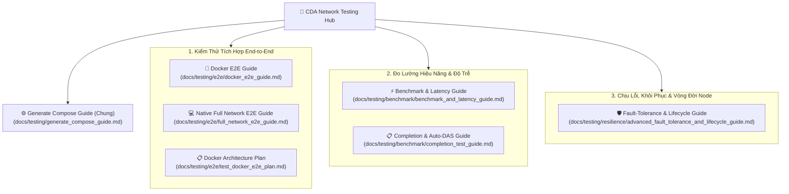

# Trung Tâm Tài Liệu & Kịch Bản Kiểm Thử CDA Network (Testing Hub)

Chào mừng bạn đến với trung tâm tài liệu và chương trình kiểm thử của dự án **CDA Network**. 

Toàn bộ tài liệu hướng dẫn và chương trình kiểm thử đã được tổ chức phân tầng thành các thư mục độc lập theo tính chất kỹ thuật:

```
📁 docs/testing/                           📁 scripts/
├── generate_compose_guide.md (DÙNG CHUNG) ├── 📁 bots/
├── 📁 e2e/                                │   ├── block_publisher_bot.py
│   ├── docker_e2e_guide.md                │   └── bot_das.sh
│   ├── full_network_e2e_guide.md          ├── 📁 tests/
│   └── test_docker_e2e_plan.md            │   ├── 📁 e2e/
├── 📁 benchmark/                          │   │   ├── test_docker_e2e.sh
│   ├── benchmark_and_latency_guide.md     │   │   └── test_full_network_e2e.sh
│   └── completion_test_guide.md           │   ├── 📁 benchmark/
└── 📁 resilience/                         │   │   ├── test_pipeline_block_timing.py
    └── advanced_fault_tolerance_and_      │   │   ├── test_sequential_block_timing.py
        lifecycle_guide.md                 │   │   ├── benchmark_matrix_runner.py
                                           │   │   └── analyze_benchmarks.py
                                           │   └── 📁 resilience/
                                           │       ├── test_consensus_tx_flow.sh
                                           │       ├── test_scenario_3.sh
                                           │       ├── test_store_join_leave_lifecycle.sh
                                           │       ├── test_light_single_seed_das.sh
                                           │       └── test_precompute_pipeline_isolated.sh
                                           ├── cleanup.sh
                                           ├── das.sh
                                           ├── generate_compose.py
                                           └── publish.sh
```

---

## 1. Bản Đồ Kiểm Thử Hệ Thống (Testing Sitemap)



---

## 2. Chi Tiết Các Nhóm Tài Liệu & Chương Trình Kiểm Thử

### 2.0. Tài Liệu Cấu Hình Chung Dùng Cho Toàn Bộ Kiểm Thử
* **[Hướng Dẫn Cấu Hình Trình Sinh Docker Compose (generate_compose_guide.md)](file:///home/ubuntu/cda-network/docs/testing/generate_compose_guide.md)**:
  - **Script thực thi:** [`scripts/generate_compose.py`](file:///home/ubuntu/cda-network/scripts/generate_compose.py)
  - Hướng dẫn toàn diện về bảng cờ tham số CLI, cơ chế sinh tự động topology mạng phân tán, cấu hình concurrency, quota CPU và tự động sinh Prometheus & Grafana (được dùng chung bởi E2E, Benchmark và Isolation tests).

### 2.1. Nhóm E2E — Kiểm Thử Tích Hợp Toàn Mạng (`e2e/`)
Tập trung vào kiểm thử tích hợp khép kín từ tầng đồng thuận CometBFT qua mạng P2P libp2p tới lưu trữ Custody và lấy mẫu Auto-DAS.
* **[Hướng Dẫn Docker E2E (docs/testing/e2e/docker_e2e_guide.md)](file:///home/ubuntu/cda-network/docs/testing/e2e/docker_e2e_guide.md)**:
  - **Script thực thi:** [`scripts/tests/e2e/test_docker_e2e.sh`](file:///home/ubuntu/cda-network/scripts/tests/e2e/test_docker_e2e.sh)
  - Khởi chạy toàn bộ mạng lưới trong các container Docker độc lập, tích hợp CometBFT, P2P libp2p, Custody Store, Light Auto-DAS và trực quan hóa thời gian thực qua Prometheus & Grafana.
* **[Hướng Dẫn Native Full Network E2E (docs/testing/e2e/full_network_e2e_guide.md)](file:///home/ubuntu/cda-network/docs/testing/e2e/full_network_e2e_guide.md)**:
  - **Script thực thi:** [`scripts/tests/e2e/test_full_network_e2e.sh`](file:///home/ubuntu/cda-network/scripts/tests/e2e/test_full_network_e2e.sh)
  - Chạy mạng lưới dưới dạng các tiến trình nhị phân nền trực tiếp trên host (không qua Docker), thích hợp cho phát triển và debug nhanh.
* **[Kế Hoạch Kiến Trúc Docker E2E (docs/testing/e2e/test_docker_e2e_plan.md)](file:///home/ubuntu/cda-network/docs/testing/e2e/test_docker_e2e_plan.md)**:
  - Tài liệu phân tích thiết kế, ánh xạ subnet và routing giữa các container.

### 2.2. Nhóm Benchmark — Đo Lường Hiệu Năng & Độ Trễ (`benchmark/`)
Tập trung vào đo đạc chính xác thời gian xử lý khối, thông lượng, độ trễ từng giai đoạn ($T_{\text{publish}}, T_{\text{kzg}}, T_{\text{seed}}, T_{\text{lock}}$) và kiểm chứng tối ưu hóa (Protobuf, QUIC, Binary Codec, Fast Lock).
* **[Hướng Dẫn Đo Lường Hiệu Năng & Độ Trễ Khối (docs/testing/benchmark/benchmark_and_latency_guide.md)](file:///home/ubuntu/cda-network/docs/testing/benchmark/benchmark_and_latency_guide.md)**:
  - **Scripts thực thi:**
    - [`scripts/tests/benchmark/test_pipeline_block_timing.py`](file:///home/ubuntu/cda-network/scripts/tests/benchmark/test_pipeline_block_timing.py): Đo độ trễ pipeline 1-block-ahead (chế độ tối ưu cao nhất).
    - [`scripts/tests/benchmark/test_sequential_block_timing.py`](file:///home/ubuntu/cda-network/scripts/tests/benchmark/test_sequential_block_timing.py): Đo độ trễ tuần tự cơ sở từng khối (Cold Latency).
    - [`scripts/tests/benchmark/benchmark_matrix_runner.py`](file:///home/ubuntu/cda-network/scripts/tests/benchmark/benchmark_matrix_runner.py): Tự động quét ma trận đa tham số ($K$, CPU Cores, Batch Sizes, Concurrency).
    - [`scripts/tests/benchmark/analyze_benchmarks.py`](file:///home/ubuntu/cda-network/scripts/tests/benchmark/analyze_benchmarks.py): Phân tích kết quả JSON và tự động xuất báo cáo Markdown.
* **[Hướng Dẫn Ghi Nhận Hoàn Thành & Lấy Mẫu DAS (docs/testing/benchmark/completion_test_guide.md)](file:///home/ubuntu/cda-network/docs/testing/benchmark/completion_test_guide.md)**:
  - Kiểm tra trạng thái `IsComplete` trong file `completion.log` của Store Nodes và cơ chế Reactive Auto-DAS của Light Node.

### 2.3. Nhóm Resilience — Khả Năng Chịu Lỗi, Phục Hồi Dữ Liệu & Vòng Đời Node (`resilience/`)
Tập trung vào kiểm chứng tính toàn vẹn toán học của Reed-Solomon MT-2D + RLNC khi mạng gặp sự cố cực hạn, mất node hoặc sập nguồn.
* **[Hướng Dẫn Kiểm Thử Kịch Bản Chịu Lỗi & Vòng Đời Node (docs/testing/resilience/advanced_fault_tolerance_and_lifecycle_guide.md)](file:///home/ubuntu/cda-network/docs/testing/resilience/advanced_fault_tolerance_and_lifecycle_guide.md)**:
  - **Scripts thực thi:**
    - [`scripts/tests/resilience/test_consensus_tx_flow.sh`](file:///home/ubuntu/cda-network/scripts/tests/resilience/test_consensus_tx_flow.sh): Luồng giao dịch CometBFT & xác thực BFT Header trực tiếp tại Publisher.
    - [`scripts/tests/resilience/test_scenario_3.sh`](file:///home/ubuntu/cda-network/scripts/tests/resilience/test_scenario_3.sh): Phục hồi khối phân tán khi **mất 1 cột mạng** (128 ô EDS) và **mất 50% ma trận** (512 ô EDS).
    - [`scripts/tests/resilience/test_store_join_leave_lifecycle.sh`](file:///home/ubuntu/cda-network/scripts/tests/resilience/test_store_join_leave_lifecycle.sh): Vòng đời Store Node: Tham gia động (Dynamic Join), Rời mạng chủ động (Graceful Leave), và Sập nguồn đột ngột (Crash / SIGKILL).
    - [`scripts/tests/resilience/test_light_single_seed_das.sh`](file:///home/ubuntu/cda-network/scripts/tests/resilience/test_light_single_seed_das.sh): Light Node khám phá toàn bộ 32 cột ma trận chỉ từ 1 địa chỉ seed ban đầu.
    - [`scripts/tests/resilience/test_precompute_pipeline_isolated.sh`](file:///home/ubuntu/cda-network/scripts/tests/resilience/test_precompute_pipeline_isolated.sh): Kiểm thử độc lập cơ chế đệm tính toán trước trong Docker đa cột.

### 2.4. Nhóm Bots & Tiện Ích (`scripts/bots/` & `scripts/`)
- [`scripts/bots/block_publisher_bot.py`](file:///home/ubuntu/cda-network/scripts/bots/block_publisher_bot.py): Bot đẩy block liên tục theo sự kiện SSE `/events/block-ready`.
- [`scripts/bots/bot_das.sh`](file:///home/ubuntu/cda-network/scripts/bots/bot_das.sh): Bot liên tục thực hiện lấy mẫu DAS khi có khối mới.
- [`scripts/publish.sh`](file:///home/ubuntu/cda-network/scripts/publish.sh): Tiện ích đẩy khối thủ công với ma trận $K$ và kích thước ô tùy ý.
- [`scripts/das.sh`](file:///home/ubuntu/cda-network/scripts/das.sh): Tiện ích kích hoạt lấy mẫu DAS thủ công trên Light Node.
- [`scripts/cleanup.sh`](file:///home/ubuntu/cda-network/scripts/cleanup.sh): Dọn dẹp sạch sẽ tài nguyên mạng, container, database BadgerDB và tiến trình nền.
- [`scripts/generate_compose.py`](file:///home/ubuntu/cda-network/scripts/generate_compose.py): Bộ sinh cấu hình Docker Compose động theo tham số.

---

## 3. Bảng Tra Cứu Lệnh Nhanh (Cheat Sheet)

```bash
# -------------------------------------------------------------
# 1. KIỂM THỬ E2E TÍCH HỢP TOÀN MẠNG
# -------------------------------------------------------------
# Chạy E2E Docker Smoke Test (~45s):
./scripts/tests/e2e/test_docker_e2e.sh -k 8 -p 4 -c 1 -s 4 -l 1 -b 2

# Chạy E2E Docker giữ lại Grafana (cổng 3000):
./scripts/tests/e2e/test_docker_e2e.sh -k 16 -p 4 -c 2 -s 8 -l 2 -b 3 --keep-alive

# Chạy E2E Native trực tiếp trên Host:
./scripts/tests/e2e/test_full_network_e2e.sh -k 8 -p 4 -b 3

# -------------------------------------------------------------
# 2. ĐO LƯỜNG HIỆU NĂNG XỬ LÝ KHỐI (BENCHMARK)
# -------------------------------------------------------------
# Đo độ trễ Pipeline 1-Block-Ahead (Khối 2MB, K=64):
python3 scripts/tests/benchmark/test_pipeline_block_timing.py --k 64 --count 3 --cell-size 512

# Đo độ trễ tuần tự cơ sở (Strict Sequential):
python3 scripts/tests/benchmark/test_sequential_block_timing.py --k 64 --count 3 --cell-size 512

# Chạy ma trận benchmark tự động:
python3 scripts/tests/benchmark/benchmark_matrix_runner.py --type baseline --matrix-k 8,16 --blocks 3

# Phân tích kết quả benchmark:
python3 scripts/tests/benchmark/analyze_benchmarks.py data/benchmarks/benchmark_latest.json

# -------------------------------------------------------------
# 3. KIỂM THỬ KHẢ NĂNG CHỊU LỖI & VÒNG ĐỜI (RESILIENCE)
# -------------------------------------------------------------
# Kiểm thử phục hồi khối khi mất 50% ma trận (Kịch bản 3):
bash scripts/tests/resilience/test_scenario_3.sh

# Kiểm thử vòng đời Store Node (Join, Leave, Crash TTL):
bash scripts/tests/resilience/test_store_join_leave_lifecycle.sh

# Kiểm thử giao dịch CometBFT & CDA Header:
bash scripts/tests/resilience/test_consensus_tx_flow.sh

# Kiểm thử khám phá ma trận từ 1 seed duy nhất:
bash scripts/tests/resilience/test_light_single_seed_das.sh

# -------------------------------------------------------------
# 4. TIỆN ÍCH DỌN DẸP & VẬN HÀNH THỦ CÔNG
# -------------------------------------------------------------
# Dọn dẹp toàn bộ dữ liệu & container sau test:
bash scripts/cleanup.sh

# Đẩy block thủ công (BlockID, Publisher URL, K, CellSize):
./scripts/publish.sh manual-block-1 http://localhost:8080 8 64

# Kích hoạt lấy mẫu DAS thủ công:
./scripts/das.sh manual-block-1 http://localhost:9401
```
