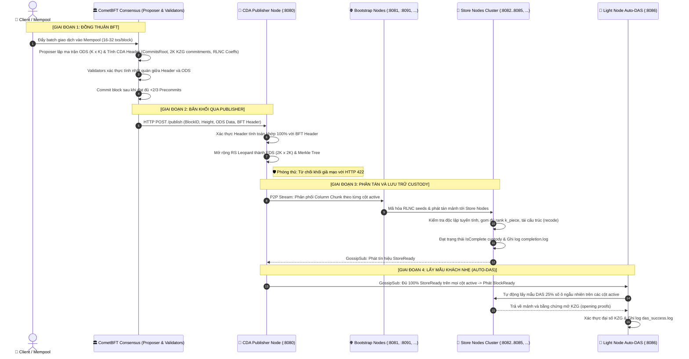

# Hướng Dẫn Kịch Bản Kiểm Thử Toàn Mạng E2E (Full Network E2E Test Guide)

Tài liệu này hướng dẫn chi tiết cách vận hành và tùy biến kịch bản kiểm thử tích hợp toàn diện (**End-to-End Multi-Block Network Pipeline**) từ tầng đồng thuận **CometBFT**, qua tầng xuất bản **Publisher Node**, tầng định tuyến và lưu trữ custody (**Bootstrap & Store Nodes**) tới tầng kiểm chứng khách nhẹ (**Light Node Auto-DAS**).

---

## 1. Kiến Trúc Luồng Kiểm Thử Khép Kín (E2E Architecture Flow)

Kịch bản kiểm thử [`scripts/tests/test_full_network_e2e.sh`](file:///home/ubuntu/cda-network/scripts/tests/test_full_network_e2e.sh) mô phỏng toàn bộ chu trình sống của các giao dịch trong mạng lưới phi tập trung CDA:



---

## 2. Bảng Tham Số Tùy Chỉnh (CLI Parameters)

Script [`scripts/tests/test_full_network_e2e.sh`](file:///home/ubuntu/cda-network/scripts/tests/test_full_network_e2e.sh) hỗ trợ tùy biến toàn bộ thông số mạng lưới qua dòng lệnh:

| Cờ ngắn | Cờ dài | Mặc định | Mô tả chi tiết |
| :--- | :--- | :--- | :--- |
| `-k` | `--k` | `8` | Kích thước cạnh ma trận dữ liệu gốc ODS ($K \times K$). Ma trận mở rộng EDS sẽ có kích thước $2K \times 2K$, và số cam kết cột KZG là $2K$. |
| `-p` | `--k-piece` | `4` | Số mảnh phân mảnh đại số RLNC trên mỗi ô dữ liệu (cell). |
| `-c` | `--cols`, `--active-cols` | `1` | Số lượng cột mạng hoạt động song song. Với mỗi cột $c$, script sẽ dựng 1 Bootstrap Node và cụm Store Nodes tương ứng. |
| `-n` | `--num-cols`, `--network-cols` | `2*K` | Tổng số nhóm cột mạng vật lý/logic (network column groups). Số cột dữ liệu EDS mà mỗi cột mạng phụ trách là $\frac{2K}{\text{NumCols}}$. Lưu ý: ma trận EDS luôn có $2K$ hàng (rows) trên mỗi cột dữ liệu. |
| `-s` | `--stores-per-col`, `--stores` | `4` | Số lượng Store Node phụ trách lưu trữ custody trên mỗi cột active (ví dụ: 2, 4, 8...). Tổng số Store Nodes = `cols * stores-per-col`. |
| `-l` | `--light-nodes`, `--lights` | `1` | Số lượng Light Node độc lập khởi chạy để cùng thực hiện kiểm thử lấy mẫu DAS song song. |
| `-b` | `--blocks` | `3` | Số lượng block liên tiếp được tạo, đồng thuận và đưa qua pipeline mạng lưới. |
| `-t` | `--txs` | `16` | Số lượng giao dịch thực tế được bơm vào mempool cho mỗi block. |
| `-h` | `--help` | - | In toàn bộ hướng dẫn sử dụng và ví dụ ra màn hình terminal. |

---

## 3. Hướng Dẫn Khởi Chạy Từng Kịch Bản

### 3.1. Chạy với thông số mặc định (Khuyến nghị cho kiểm tra nhanh)
Cấu hình: $K=8$ (64 ô ODS, 256 ô EDS), $K_{\text{piece}}=4$, 1 cột mạng, 4 store nodes/cột, 1 light node, 3 block liên tiếp, 16 txs/block.
```bash
./scripts/tests/test_full_network_e2e.sh
```

### 3.2. Điều chỉnh số lượng Store Node, Light Node và Num Cols
Bạn có thể dễ dàng tăng giảm mật độ Store Node phân tán trên mỗi cột, số lượng khách nhẹ (Light Node) và tổng số cột mạng (`num-cols`):
```bash
# Cụm nhẹ: 2 Store Nodes trên mỗi cột, 2 Light Nodes cùng thực hiện DAS:
./scripts/tests/test_full_network_e2e.sh -s 2 -l 2

# Tùy biến tổng số cột mạng (num-cols = 16) kết hợp 2 cột active:
./scripts/tests/test_full_network_e2e.sh -c 2 -n 16 -s 4 -l 2

# Cụm mở rộng: 2 cột active, mỗi cột 6 Store Nodes (tổng cộng 12 Store Nodes) và 3 Light Nodes:
./scripts/tests/test_full_network_e2e.sh -c 2 -s 6 -l 3 -b 2
```

### 3.3. Chạy với ma trận lớn ($K=16$ hoặc $K=32$)
Tăng khối lượng dữ liệu kiểm thử, kiểm tra khả năng chịu tải tính toán đa thức và cam kết mật mã KZG:
```bash
# Ma trận K=16 (256 ô ODS, 1024 ô EDS, 32 cam kết cột KZG):
./scripts/tests/test_full_network_e2e.sh -k 16 -b 3

# Ma trận cực lớn K=32 (1024 ô ODS, 4096 ô EDS, 64 cam kết cột KZG, 32 txs):
./scripts/tests/test_full_network_e2e.sh --k 32 --k-piece 8 --blocks 2 --txs 32
```

### 3.4. Chạy cụm mạng đa cột song song (`active-cols > 1`)
Kiểm thử tính năng đồng bộ và lấy mẫu DAS phân tán trên nhiều cột mạng vật lý độc lập:
```bash
# Khởi động cụm 2 cột active (Col 0 và Col 1):
# Gồm: 1 Publisher, 2 Bootstrap Nodes (:8100, :8200), 8 Store Nodes (:8101..8104, :8201..8204), 2 Light Nodes (:8086, :8087)
./scripts/tests/test_full_network_e2e.sh -k 8 -c 2 -s 4 -l 2 -b 2
```

### 3.5. Chạy với tham số vị trí rút gọn (Positional Arguments)
Cú pháp: `./test_full_network_e2e.sh [K] [K_PIECE] [BLOCKS] [TXS] [ACTIVE_COLS] [STORES_PER_COL] [LIGHT_NODES] [NUM_COLS]`
```bash
# Ví dụ: K=16, K_piece=4, 5 blocks, 32 txs, 2 cột active, 4 stores/cột, 2 light nodes, 32 num-cols:
./scripts/tests/test_full_network_e2e.sh 16 4 5 32 2 4 2 32
```

### 3.6. Chạy thông qua biến môi trường (CI / CD Pipeline)
```bash
CDA_K=16 CDA_NUM_COLS=32 CDA_ACTIVE_COLS=2 CDA_STORES_PER_COL=4 CDA_LIGHT_NODES=2 CDA_BLOCKS=4 ./scripts/tests/test_full_network_e2e.sh
```

---

## 4. Cơ Chế Kiểm Tra Tính Toàn Vẹn & An Toàn Được Tích Hợp

Trong mỗi lần chạy kiểm thử, hệ thống tự động kiểm chứng các đặc tính bảo mật và kỹ thuật cốt lõi:

1. **Bảo đảm thứ tự xử lý khối (Sequential Completion Gate):**
   - Khi các block được commit liên tiếp, Publisher Node giữ hàng đợi (`Publisher Queue`) bảo đảm Block $H+1$ chỉ được phân tán khi Block $H$ đã đạt $100\%$ Store custody.
   - Ngăn chặn triệt để tình trạng nhảy cóc dữ liệu hoặc tranh chấp tài nguyên phân tán.

2. **Phòng thủ từ chối khối giả mạo (Adversarial Tamper Defense):**
   - Ở mỗi block, script tự động giả lập một đợt tấn công: tạo một khối có `CommitsRoot` bị chỉnh sửa độc hại và gửi tới Publisher.
   - Publisher thực thi hàm `VerifyCDAHeader`, phát hiện mismatch và lập tức từ chối với mã lỗi **`HTTP 422 Unprocessable Entity`**.

3. **Tính toán độc lập tuyến tính & Quản lý Custody:**
   - Store Nodes chỉ lưu các mảnh có định thức ma trận độc lập (`Rank Check`), loại bỏ hoàn toàn các mảnh trùng lặp (`redundant`).
   - Khi đủ rank $K_{\text{piece}}$, node tự động chuyển trạng thái `IsComplete` và lưu log tại `data/store_<port>/completion.log`.

4. **Event-Driven Auto-DAS theo thời gian thực:**
   - Light Node không cần thăm dò (poll), mà tự động phản ứng ngay khi nhận tín hiệu GossipSub `BlockReady`.
   - Lấy mẫu $25\%$ số ô dữ liệu ngẫu nhiên, kết nối P2P tới Store Node sở tại và kiểm chứng đại số với cam kết cột KZG trên Block Header.

---

## 5. Theo Dõi Log & Phân Tích Kết Quả

Khi script đang chạy hoặc sau khi chạy xong, bạn có thể kiểm tra trực tiếp các file log:

```bash
# 1. Xem kết quả lấy mẫu Auto-DAS của Light Node:
cat data/light_8086/das_success.log

# 2. Xem log chi tiết các bước lấy mẫu và thời gian xác thực đại số:
grep "Auto-DAS" light.log

# 3. Xem log xác thực BFT Header và xử lý hàng đợi của Publisher:
grep -E "Publisher Queue|SUCCESS: Header verification|Header verification FAILED" publisher.log

# 4. Xem log tín hiệu hoàn thành custody của các Store Nodes:
grep "StoreReady signal broadcasted" store*.log

# 5. Xem log xác nhận trạng thái IsComplete cục bộ của Store Node:
cat data/store_8082/completion.log
```

### Báo cáo mẫu khi chạy thành công:
```text
==========================================================================
                  E2E MULTI-BLOCK VERIFICATION REPORT                     
==========================================================================

--- [1. Publisher BFT Header Verification & Tamper Defense] ---
✅ Valid Blocks Verified by Publisher: 2 / 2
🛡️ Tampered Blocks Rejected by Publisher (HTTP 422): 1
2026/09/09 07:52:52 [Height: 1] [Publisher] SUCCESS: Header verification passed for BlockID block-1 against BFT consensus!
2026/09/09 07:52:52 [Height: 1] [Publisher] Header verification FAILED for BlockID block-1: mismatched CommitsRoot
2026/09/09 07:52:58 [Height: 2] [Publisher] SUCCESS: Header verification passed for BlockID block-2 against BFT consensus!
---------------------------------------------------------------

--- [2. Store Node Custody Signals Across Blocks] ---
Total StoreReady signals emitted across cluster: 72
-----------------------------------------------------

--- [3. Light Node Auto-DAS Verifications] ---
Total Blocks Verified by Light Node DAS: 2 / 2
2026/09/09 07:52:52 [Auto-DAS] [Height: 1] 🚀 BlockReady triggered DAS for block-1 — sampling 8/32 active cells (25%)...
2026/09/09 07:52:52 [Auto-DAS] [Height: 1] ✅ DAS VERIFIED for block-1 (8/8 sampled cells verified in 21.33ms)
2026/09/09 07:52:59 [Auto-DAS] [Height: 2] 🚀 BlockReady triggered DAS for block-2 — sampling 8/32 active cells (25%)...
2026/09/09 07:52:59 [Auto-DAS] [Height: 2] ✅ DAS VERIFIED for block-2 (8/8 sampled cells verified in 36.25ms)
----------------------------------------------

🎉🎉🎉 MULTI-BLOCK END-TO-END VERIFICATION COMPLETE & SUCCESSFUL! 🎉🎉🎉
✅ 1. Processed 2 consecutive blocks (Height 1 -> ... -> 2) through consensus
✅ 2. CometBFT Proposer computed unique CDA Headers for each block height
✅ 3. CometBFT Validators verified proposal CDA Headers against transaction ODS
✅ 4. Consensus committed all 2 blocks with BFT finality
✅ 5. Publisher Node verified BFT Headers against consensus commitments
✅ 6. Publisher Node correctly REJECTED adversarial tampered header (HTTP 422)
✅ 7. Column chunks distributed to Store Nodes across 2 active column(s)
✅ 8. Light Node completed Data Availability Sampling (DAS) for all 2 blocks!
=== Cleaning up all background node processes ===
```

---

## 6. Hướng Dẫn Dọn Dẹp Sau Khi Chạy (Cleanup Guide)

### 6.1. Cơ chế tự động dọn dẹp (Automated Trap Cleanup)
Script [`test_full_network_e2e.sh`](file:///home/ubuntu/cda-network/scripts/tests/test_full_network_e2e.sh) đã được tích hợp sẵn bẫy tín hiệu hệ thống (`trap cleanup EXIT`):
- **Tự động kích hoạt khi kết thúc:** Bất kể kịch bản chạy thành công, thất bại, hoặc bị người dùng ngắt ngang bằng phím `Ctrl + C`, script đều tự động gửi tín hiệu dừng (`kill -9`) đến tất cả các PID của Publisher, Bootstrap, Store và Light Node.
- **Tự động xóa nhị phân tạm:** Thư mục `bin/` chứa các file thực thi tạm thời cũng được xóa sạch sẽ khi thoát.

### 6.2. Dọn dẹp bằng tiện ích một dòng lệnh (Khuyến nghị)
Trong trường hợp bạn tắt terminal cưỡng bức hoặc muốn giải phóng triệt để toàn bộ tài nguyên cổng mạng và ổ đĩa trước/sau khi kiểm thử, hãy sử dụng tiện ích dọn dẹp tập trung của hệ thống:

```bash
bash scripts/cleanup.sh
```

Tiện ích này sẽ tự động:
1. Quét và buộc dừng triệt để tất cả các tiến trình node nền (`publisher`, `bootstrap`, `store`, `light`).
2. Tắt và xóa toàn bộ các container Docker Compose (nếu có).
3. Xóa sạch cơ sở dữ liệu BadgerDB cục bộ (`data/store_*`, `data/publisher`), thư mục cache (`data/light_*`, `data/bootstrap_*`), các file log phát sinh (`publisher.log`, `light.log`, `store*.log`, `bootstrap*.log`) và các file khóa danh tính Store Node (`store_*.key`).

### 6.3. Lệnh dọn dẹp thủ công từng bước (Manual Force Cleanup)
Nếu bạn muốn tự tay thực hiện từng bước mà không chạy script tiện ích:

```bash
# Bước 1: Buộc dừng tất cả tiến trình node CDA đang chạy nền
pkill -9 -f "bin/publisher|bin/bootstrap|bin/store|bin/light" || true

# Bước 2: Xóa sạch dữ liệu BadgerDB, cache, logs và các file định danh .key
rm -rf data/store_* data/light_* data/publisher data/bootstrap_*
rm -f publisher.log light.log bootstrap*.log store*.log data/completion.log
rm -f store_*.key *.key

# Bước 3: Dọn dẹp thư mục nhị phân biên dịch
rm -rf bin/
```

> [!IMPORTANT]
> **Tại sao cần xóa thư mục `data/` và file `store_*.key` giữa các lần kiểm thử?**
> 1. **Thư mục `data/`:** Các Store Node sử dụng BadgerDB để lưu trữ bền vững các mảnh dữ liệu (pieces). Nếu không xóa thư mục `data/store_*` trước một lượt chạy mới, Store Node sẽ nạp lại các mảnh từ lượt chạy trước và đánh dấu các mảnh mới nhận được là `dependent (redundant)` (trùng lặp). Điều này có thể khiến trạng thái custody `IsComplete` không được kích hoạt đúng lúc, dẫn tới trễ tín hiệu `StoreReady` và `BlockReady`.
> 2. **File `store_*.key`:** Khi kiểm thử với các kích thước $K$ khác nhau (ví dụ: $K=4 \to K=8 \to K=32$), kích thước lưới $2K \times 2K$ sẽ thay đổi. File `store_*.key` lưu trữ cặp khóa Ed25519 được sinh tương ứng với kích thước lưới $2K \times 2K$. Nếu không xóa, node sẽ tải lại khóa cũ (`Loaded cached keypair`) sinh từ $K$ cũ thay vì sinh khóa mới khớp với ma trận $K$ hiện tại.
>
> *(Lưu ý: Trong môi trường Production/Staging thực tế, file `.key` cần được **giữ nguyên** qua các lần khởi động lại để duy trì danh tính PeerID cố định của node trong mạng P2P).*

