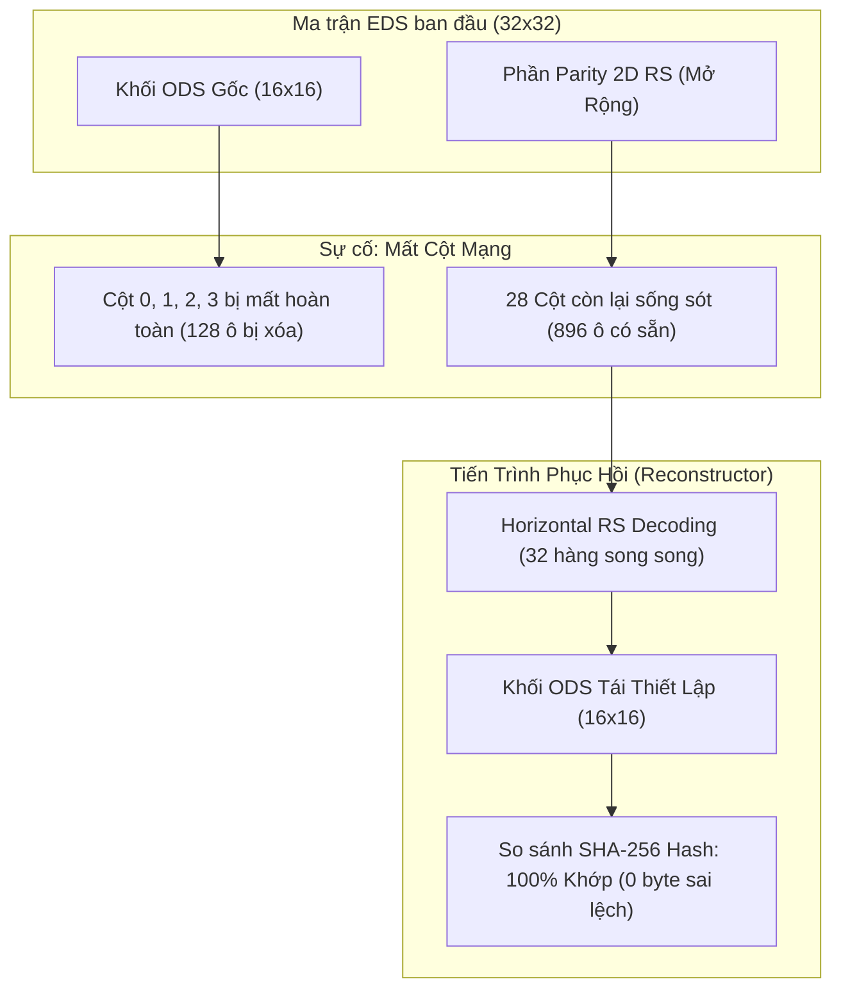

# Hướng Dẫn Kiểm Thử — Kịch Bản 3: Phục Hồi Dữ Liệu Khối Phân Tán (Distributed Block Reconstruction)

Tài liệu này cung cấp hướng dẫn chi tiết từng bước để thực hiện kiểm chứng **Kịch bản 3: Kiểm thử phục hồi dữ liệu khối phân tán (Distributed Block Reconstruction)** trong hệ thống CDA Network theo đặc tả kỹ thuật.

---

## 1. Mục Tiêu & Cơ Chế Hoạt Động

### A. Mục Tiêu Kiểm Thử
Chứng minh rằng hệ thống CDA Network có khả năng **tự động phục hồi nguyên vẹn $100\%$ khối dữ liệu gốc (ODS)** từ mạng lưới phân tán ngay cả khi:
- Một hoặc nhiều cột mạng bị mất hoàn toàn ($100\%$ Store Node trong cột đó bị sập hoặc mất kết nối).
- Mất mát dữ liệu lên tới **$50\%$ toàn bộ ma trận EDS** (giới hạn tối đa theo lý thuyết của mã hóa Reed-Solomon $2K \to K$).

### B. Nguyên Lý Phục Hồi Ma Trận 2D (Reed-Solomon Horizontal Decoding)
Trong ma trận mở rộng 2D Reed-Solomon ($2K \times 2K$ EDS với $K=16 \implies 32 \times 32 = 1024$ ô):
1. Mỗi hàng $r$ ($0 \le r < 32$) bao gồm 32 ô (16 ô ODS gốc + 16 ô parity chẵn lẻ).
2. Khi mất $M$ cột ($M \le 16$), trên mỗi hàng $r$ vẫn còn ít nhất $32 - M \ge 16$ ô còn sống sót.
3. Thuật toán **Leopard Reed-Solomon Decoder** (`reedsolomon.Encoder.Reconstruct`) sẽ quét qua từng hàng theo chiều ngang, sử dụng các ô còn sống để giải hệ phương trình Galois Field và tái tạo lại chính xác các ô bị thiếu ở cột đã mất.
4. Sau khi phục hồi xong 32 hàng, góc phần tư trên-trái ($16 \times 16$) chính là khối dữ liệu ODS ban đầu.



---

## 2. Hướng Dẫn Chạy Kiểm Thử Tự Động

### Bước 1: Khởi Động Môi Trường Mạng (Tùy chọn)
Nếu muốn kiểm thử tích hợp trực tiếp với toàn bộ cluster:
```bash
# Tạo cấu hình và khởi chạy cluster
python3 scripts/generate_compose.py --cols 8 --active-cols 1 --stores-per-col 8 --lights 1 --k 16 --k-piece 4 --prune-enable --prune-ttl 15s
docker compose -f docker-compose.json up -d
```

### Bước 2: Thực Thi Script Kiểm Thử Tự Động
Chạy script tự động hóa toàn bộ Kịch bản 3:
```bash
bash scripts/tests/test_scenario_3.sh
```

---

## 3. Chạy Kiểm Thử Bằng Lệnh Tùy Chỉnh (Manual / Parameterized Testing)

Chương trình phục hồi [reconstruct_scenario3](file:///home/ubuntu/cda-network/cda-publisher-node/cmd/reconstruct_scenario3/main.go) hỗ trợ các tham số dòng lệnh linh hoạt:

### A. Kiểm Thử Mất 1 Cột Mạng (4 Cột Dữ Liệu = 128 Ô Bị Mất)
```bash
# Biên dịch (nếu chưa biên dịch)
go build -o bin/reconstruct_scenario3 ./cda-publisher-node/cmd/reconstruct_scenario3/main.go

# Chạy kiểm thử mất 4 cột dữ liệu
./bin/reconstruct_scenario3 -k 16 -lost-cols 4 -publisher http://localhost:8080 -light http://localhost:9401
```

### B. Kiểm Thử Chịu Tải Cực Hạn (Stress Test: Mất 16 Cột = 50% Ma Trận)
```bash
./bin/reconstruct_scenario3 -k 16 -lost-cols 16 -publisher http://localhost:8080 -light http://localhost:9401
```

### C. Tùy Chọn Tham Số:
- `-k <int>`: Kích thước khối ODS ($K \times K$). Mặc định là `16` (256 ô).
- `-lost-cols <int>`: Số lượng cột bị giả lập mất mát dữ liệu hoàn toàn. Mặc định là `4`.
- `-publisher <url>`: Địa chỉ Publisher Node để kiểm thử xuất bản khối trực tiếp (mặc định: `http://localhost:8080`).
- `-light <url>`: Địa chỉ Light Node để kiểm tra DAS (mặc định: `http://localhost:9401`).

---

## 4. Phân Tích Kết Quả Đầu Ra (Output Interpretation)

Khi chạy kiểm thử thành công, kết quả hiển thị trên terminal sẽ bao gồm 7 giai đoạn:

```
================================================================================
       KỊCH BẢN 3: KIỂM THỬ PHỤC HỒI DỮ LIỆU KHỐI PHÂN TÁN (DISTRIBUTED RECONSTRUCTION)
================================================================================
[*] Matrix Parameters: K = 16 (ODS: 16x16 = 256 cells, EDS: 32x32 = 1024 cells)
[*] Cell Size: 64 bytes (Total ODS Payload: 16384 bytes)
[*] Target Block ID: scenario3-recon-1786373304

[Phase 1] Khởi tạo dữ liệu gốc ODS (Original Data Square)...
[+] Original ODS SHA-256 Hash: 1df0337aec626da9d43ba646f1fccc886dc5dcf5b40f86f4ceb5181547497812

[Phase 2] Mã hóa 2D Reed-Solomon (EDS Generation using Leopard Codec)...
[+] 2D RS-Leopard Extended Data Square computed successfully in 2.94709ms

[Phase 3] Xuất bản khối lên Publisher Node (http://localhost:8080/publish)...
[+] Successfully published block scenario3-recon-1786373304 to network

[Phase 4] Giả lập sự cố mất mát hoàn toàn 16 cột dữ liệu (Network Column Outage)...
[!] Các cột bị mất hoàn toàn (Offline/Unavailable): Col 2 Col 5 Col 9 Col 0 Col 4 Col 10 ...
[+] Tổng số ô bị mất trong ma trận: 512 / 1024 ô (50.0%)

[Phase 5] Thực hiện giải mã Reed-Solomon ngược theo chiều ngang (Horizontal RS Row Reconstruction)...
[+] Toàn bộ 32 hàng (512 ô bị mất) đã được phục hồi thành công trong 1.307739ms!

[Phase 6] Trích xuất khối ODS và kiểm tra tính toàn vẹn byte-for-byte...
[*] Reconstructed ODS SHA-256 Hash: 1df0337aec626da9d43ba646f1fccc886dc5dcf5b40f86f4ceb5181547497812
[*] Original ODS SHA-256 Hash:      1df0337aec626da9d43ba646f1fccc886dc5dcf5b40f86f4ceb5181547497812

================================================================================
                            KẾT QUẢ KIỂM THỬ KỊCH BẢN 3
================================================================================
[+] TRẠNG THÁI: THÀNH CÔNG 100% (PASSED)
[+] Tổng số ô phục hồi: 512 ô
[+] Độ chính xác dữ liệu: 100.0% (0 byte sai lệch)
[+] Thời gian giải mã tái tạo RS: 1.307739ms (Trung bình 0.041 ms/hàng)
================================================================================
```

### Các Tiêu Chí Đánh Giá Đạt Chuẩn (Acceptance Criteria):
1. **Trạng thái PASSED 100%**: Giá trị băm `Reconstructed ODS SHA-256 Hash` phải trùng khớp tuyệt đối với `Original ODS SHA-256 Hash`.
2. **0 byte sai lệch**: Không có bất kỳ ô dữ liệu nào có byte bị lệch so với dữ liệu gốc ban đầu.
3. **Độ trễ phục hồi cực thấp**: Thời gian giải mã tái tạo RS cho toàn bộ ma trận $32 \times 32$ phải nhỏ hơn **5 ms** nhờ thư viện tối ưu hóa SIMD Leopard.
