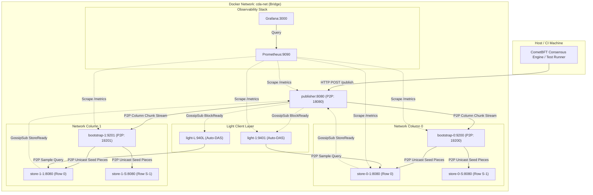

# Kế Hoạch Triển Khai Kiểm Thử CDA Network Bằng Docker & Docker Compose

Tài liệu này đề xuất kế hoạch kỹ thuật chi tiết để chuyển đổi và triển khai toàn bộ kịch bản kiểm thử End-to-End (E2E) của mạng lưới **CDA Network** sang môi trường container hóa với **Docker** và **Docker Compose**. Kịch bản sẽ bảo đảm tích hợp luồng giao dịch đồng thuận **CometBFT**, phân tán dữ liệu qua **P2P libp2p** giữa các container, lưu trữ **Custody**, lấy mẫu **Auto-DAS** trên các Light Node containers và theo dõi trực quan thời gian thực qua **Prometheus & Grafana**.

---

## 1. Mục Tiêu & Yêu Cầu Kỹ Thuật

1. **Môi trường độc lập & chuẩn hóa:**
   - Đóng gói toàn bộ 4 vai trò node: **Publisher**, **Bootstrap**, **Store**, **Light** vào Docker image đa tầng (`multi-stage build`), dung lượng gọn nhẹ dựa trên Alpine Linux.
   - Các container giao tiếp trong cùng một mạng cầu nối bridge cô lập (`cda-net`), ánh xạ cổng dịch vụ P2P và REST API ra ngoài host để kiểm thử.

2. **Khả năng co giãn linh hoạt (Dynamic Scalability):**
   - Tương thích hoàn toàn với các tham số mạng tùy chỉnh tương tự native test:
     - Kích thước ma trận $K$ (`-k`) và phân mảnh $K_{\text{piece}}$ (`-p`).
     - Số lượng nhóm cột mạng $N$ (`-n, --num-cols`).
     - Số cột mạng hoạt động $C$ (`-c, --active-cols`).
     - Số lượng Store Node trên mỗi cột $S$ (`-s, --stores-per-col`).
     - Số lượng Light Node độc lập $L$ (`-l, --light-nodes`).
     - Số lượng block liên tiếp $B$ (`-b, --blocks`).

3. **Tích hợp CometBFT Consensus & BFT Header Verification:**
   - Thay thế hoàn toàn cách tạo payload giả lập cũ bằng luồng đồng thuận CometBFT thực tế (giao dịch $\to$ mempool $\to$ Proposer sinh CDA Header $\to$ Validator verify $\to$ Commit BFT finality $\to$ Push tới Publisher container).
   - Kiểm chứng phòng thủ chống gian lận (Publisher container từ chối khối giả mạo với `HTTP 422`).

4. **Giám sát trực quan (Full Observability):**
   - Tự động dựng Prometheus (cổng 9090) cào metrics thời gian thực từ tất cả các container.
   - Tự động cấu hình Grafana (cổng 3000) với dashboard có sẵn để quan sát: Throughput, CPU/RAM, Tốc độ truyền GossipSub, Tỷ lệ thành công DAS, Latency lấy mẫu.

---

## 2. Kiến Trúc Mạng Docker Compose (`cda-net`)



---

## 3. Các Bước Triển Khai Kỹ Thuật (Phases)

### Giai Đoạn 1: Chuẩn Hóa Dockerfile & Image Build
- **Mục tiêu:** Đảm bảo Dockerfile biên dịch đầy đủ, sạch sẽ và tối ưu dung lượng cho môi trường container.
- **Chi tiết thực hiện:**
  - Cập nhật [`Dockerfile`](file:///home/ubuntu/cda-network/Dockerfile) để copy đúng các module trong Go Workspace (`go.work`).
  - Kiểm tra các cờ runtime (như `curl`, `jq`, `ca-certificates`) trong base image `alpine:latest`.
  - Đảm bảo binary được biên dịch với cờ statically linked (`CGO_ENABLED=0` hoặc giữ tương thích glibc/musl).

### Giai Đoạn 2: Nâng Cấp Bộ Sinh Cấu Hình [`scripts/generate_compose.py`](file:///home/ubuntu/cda-network/scripts/generate_compose.py)
- **Mục tiêu:** Đồng bộ toàn bộ các thuật toán tính toán ma trận mới:
  - Hỗ trợ tham số `--num-cols` ($N$).
  - Tính toán chính xác `cols_per_net_col = (2 * K) / NumCols`.
  - Gán đúng toạ độ cột xuất phát `col_id = c * cols_per_net_col` cho `bootstrap-{c}` và các `store-{c}-{s}` để tránh lỗi `peer id mismatch` danh tính P2P.
  - Cập nhật định dạng file cấu hình Publisher `publisher_config_docker.json` và chuỗi kết nối bootstrap `-bootstraps`.
  - Tự động sinh `data/prometheus.yml` và provisioning cho Grafana đúng theo số lượng container được cấu hình.

### Giai Đoạn 3: Xây Dựng Script Kiểm Thử E2E Docker [`scripts/tests/test_docker_e2e.sh`](file:///home/ubuntu/cda-network/scripts/tests/test_docker_e2e.sh)
- **Mục tiêu:** Cung cấp tiện ích một dòng lệnh để chạy kiểm thử cụm Docker từ đầu đến cuối với đầy đủ cờ CLI:
  ```bash
  ./scripts/tests/test_docker_e2e.sh -k 16 -p 4 -c 2 -s 8 -l 2 -b 5 -n 8
  ```
- **Quy trình thực thi của script:**
  1. **Tạo cấu hình Compose:** Chạy `generate_compose.py` với các tham số dòng lệnh.
  2. **Dọn dẹp môi trường cũ:** `docker compose -f docker-compose.json down -v` và xóa dữ liệu database mount cũ.
  3. **Build & Khởi động cụm:** `docker compose -f docker-compose.json up -d`.
  4. **Health-check:** Chờ các container Bootstrap, Store, Light và Publisher sẵn sàng kết nối P2P.
  5. **Chạy CometBFT Consensus:** Kích hoạt kịch bản test CometBFT đẩy $B$ block liên tiếp tới `http://localhost:8080/publish`.
  6. **Đo lường & Xác thực:**
     - Xác nhận Publisher đã kiểm tra và chấp thuận $B$ BFT block headers.
     - Xác nhận Publisher từ chối khối giả mạo với HTTP 422.
     - Xác nhận các Store Node containers lưu trữ custody đầy đủ.
     - Xác nhận tất cả Light Node containers hoàn tất Auto-DAS cho toàn bộ $B$ block.
  7. **Tùy chọn hiển thị Grafana:** Giữ cụm chạy nếu người dùng muốn mở `http://localhost:3000` xem biểu đồ hiệu năng, hoặc dọn dẹp bằng `scripts/cleanup.sh`.

### Giai Đoạn 4: Cập Nhật Tài Liệu Hướng Dẫn
- Viết tài liệu [`docs/testing/docker_e2e_guide.md`](file:///home/ubuntu/cda-network/docs/testing/docker_e2e_guide.md) hướng dẫn:
  - Cài đặt & yêu cầu tiên quyết (Docker, Docker Compose plugin v2).
  - Bảng tham số và ví dụ khởi chạy các kịch bản (nhẹ, tiêu chuẩn, ma trận lớn $K=16, 32$).
  - Cách truy cập Grafana Dashboard và ý nghĩa các chỉ số đo lường.
  - Hướng dẫn dọn dẹp tài nguyên container và volume.

---

## 4. Kế Hoạch Xác Minh (Verification Plan)

Sau khi được phê duyệt và triển khai, kế hoạch sẽ được kiểm chứng qua các bước:

### 1. Kiểm tra biên dịch & sinh file Compose
```bash
python3 scripts/generate_compose.py -k 8 -k-piece 4 -c 1 -s 4 -l 1 -n 16
docker compose -f docker-compose.json config
```
*Kỳ vọng:* Cấu hình YAML/JSON hợp lệ, không có lỗi cú pháp.

### 2. Kiểm thử chạy cụm Docker nhẹ ($K=8, 1$ cột, 4 store nodes, 1 light node, 2 blocks)
```bash
bash scripts/tests/test_docker_e2e.sh -k 8 -p 4 -c 1 -s 4 -l 1 -b 2
```
*Kỳ vọng:* Toàn bộ container chạy mượt mà, CometBFT commit 2 block, Auto-DAS 2/2 blocks thành công, trả về exit code 0.

### 3. Kiểm thử chạy cụm Docker lớn tương đương lượt chạy vừa rồi ($K=16, 2$ cột, 16 store nodes, 2 light nodes, 5 blocks, $N=8$)
```bash
bash scripts/tests/test_docker_e2e.sh -k 16 -p 4 -c 2 -s 8 -l 2 -b 5 -n 8
```
*Kỳ vọng:* 16 Store containers và 2 Light containers kết nối P2P ổn định, xử lý tuần tự cả 5 block, Grafana ghi nhận đầy đủ biểu đồ.

---

## 5. Ý Kiến & Lựa Chọn Của Người Dùng (User Review Required)

> [!IMPORTANT]
> **Về việc xử lý cụm sau khi test xong:**
> 1. **Chế độ tự động dọn dẹp (Mặc định cho CI/CD):** Sau khi test thành công, script sẽ tự động chạy `docker compose down -v` để giải phóng RAM và ổ đĩa.
> 2. **Chế độ giữ container để soi Grafana Dashboard (`--keep-alive`):** Nếu bạn muốn giữ lại cụm để truy cập `http://localhost:3000` (Grafana) xem biểu đồ trực quan, script có thể hỗ trợ cờ `--keep-alive` (khi xem xong chỉ cần gõ `bash scripts/cleanup.sh` để tắt). (Triển khai theo keep-alive)
